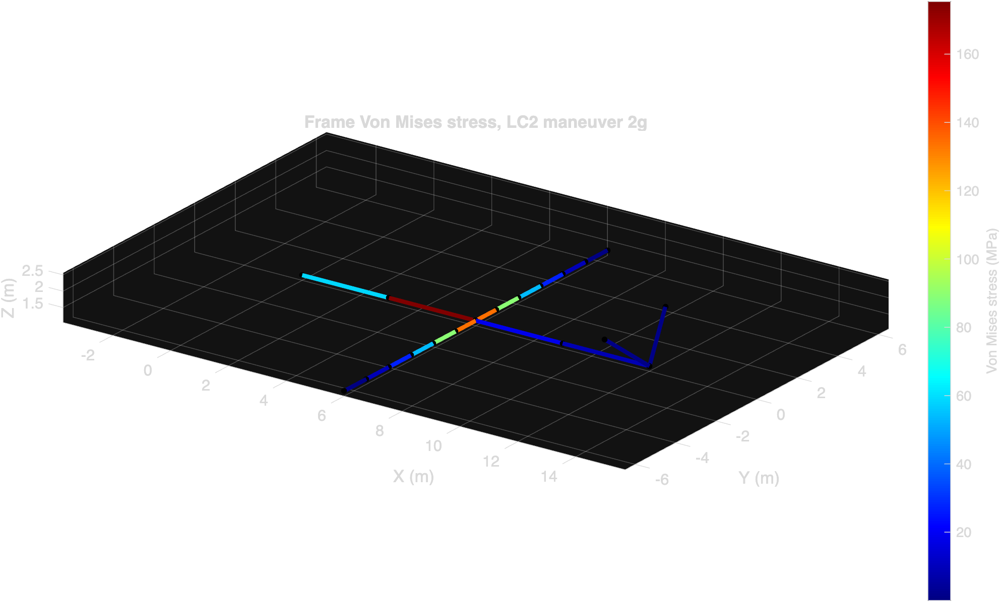

# Archer Midnight: MATLAB FEA of Frame and Landing Gear

> **Featured project, recruiter view:** the most digestible entry point is the [portable portfolio page](website/midnight-fea/index.html) (also available as plain [Markdown](website/midnight-fea/index.md) for drop-in to any static site). It leads with the three headline numbers and the five most informative figures and is intended for a 90-second skim before diving into the code.

### [Project website](https://angeloudavidj-png.github.io/archer-midnight-fea/) | [Technical report](docs/index.md) | [Portfolio page](website/midnight-fea/index.html) | [Source code](src/) | [Figures](docs/figures/)

A from-scratch 3D Euler-Bernoulli beam finite element analysis of the Archer Aviation Midnight eVTOL airframe and tricycle landing gear, written in base MATLAB with no toolbox dependencies. The project sizes structural members against four flight load cases and a FAR 23.473 hard landing case, and reports stress, displacement, and reserve factors.

### Headline results

| Metric | Value | Detail |
|---|---|---|
| Frame governing RF | **2.00** | LC2 2g maneuver, peak VM 175.4 MPa, CFRP 350 MPa allowable |
| Landing gear RF | **1.18** | LCG 3g + 0.5g drag, peak VM 427.9 MPa, 7075-T6 503 MPa yield (post-resize, marginal) |
| Drop-test dynamic factor | **1.87** | Newmark 2.6 m/s sink rate, peak contact 175 kN vs static 93 kN |
| Critical ply mode | **Matrix tension, 90°** | Boom layup [0/45/-45/90]_s, Tsai-Wu 0.40, strength ratio 2.14 |
| Parametric optimum | **312 kg @ RF 1.60** | 1400-point sweep, 137 kg lighter than current at higher RF |

The frame carries positive margin in every flight case studied. The landing gear was resized after the first analysis flagged the original 60 mm × 5 mm strut as inadequate (RF 0.27). The full design-iteration narrative plus the modal, drop-test, ply-failure, parametric, and cross-verification sections live in the [technical report](docs/index.md).



Full methodology, derivations, verification residuals, and a per-element discussion are in the [technical report](docs/index.md), also rendered on the [project website](https://angeloudavidj-png.github.io/archer-midnight-fea/). Numerical results are read directly from [data/results_summary.csv](data/results_summary.csv), which is regenerated on every MATLAB run.

**Author:** David Angelou, B.S.E. Mechanical Engineering, University of Michigan (Class of 2027)
**Status:** Educational portfolio project. All Midnight parameters are public-domain estimates or reasonable engineering approximations; no proprietary Archer data is used.

---

## Why this project

Archer's Midnight is a 6-tilt / 6-lift, 5-seat eVTOL targeting ~150 mph cruise and ~100 mi range. The structural challenges of an eVTOL frame, distributed thrust booms, integrated wing/boom load paths, and a landing gear that must survive hard vertical descents at high disk-loading, map well onto a first-principles FEA exercise.

This repository was built to:

1. Demonstrate hand-rolled 3D beam FEA in MATLAB (no PDE Toolbox dependency for the frame solver).
2. Apply realistic eVTOL load cases (hover, transition, 3g hard landing per FAR 23.473) to a representative airframe topology.
3. Produce a clean, reviewable engineering report comparable to the BERGR FRR and VTI deliverables I produce at U-M.

## Repository layout

```
archer-midnight-fea/
├── README.md                       # This file
├── PROMPT.md                       # Prompt for Claude Code in VS Code to refresh the pipeline
├── LICENSE                         # MIT
├── .gitignore
├── src/                            # MATLAB sources, full FEA implementation
│   ├── main.m                      # Master driver script (runs all load cases)
│   ├── aircraft_parameters.m       # Midnight geometry, mass, load factors
│   ├── material_properties.m       # CFRP and 7075-T6 properties
│   ├── build_frame_geometry.m      # Nodes and elements for the airframe
│   ├── build_landing_gear.m        # Nodes and elements for the tricycle gear
│   ├── tube_section.m              # Hollow circular tube section properties
│   ├── beam_element_3d.m           # 12x12 3D Euler-Bernoulli beam stiffness, global
│   ├── assemble_global_K.m         # Sparse global stiffness assembly
│   ├── apply_loads.m               # Force vector builder per load case
│   ├── apply_boundary_conditions.m # Direct elimination of constrained DOFs
│   ├── solve_fea.m                 # Solve KU = F with conditioning check
│   ├── post_process.m              # Element forces, stress, reserve factors
│   ├── visualize_deformed.m        # 3D plot of undeformed plus deformed structure
│   ├── plot_stress_contour.m       # Color-coded element stress plot
│   └── save_figure_portable.m      # Portable PNG export with consistent DPI
├── tests/                          # Verification against analytical results
│   ├── test_beam_cantilever.m      # Tip deflection vs PL^3 / 3EI, rel err 1.05e-13
│   └── test_assembly.m             # K symmetry, rigid body mode count
├── scripts/                        # End to end pipeline drivers
│   ├── run_pipeline.sh             # macOS/Linux: run MATLAB headless, commit, push
│   └── run_pipeline.ps1            # Windows: PowerShell equivalent
├── docs/                           # Report and figures, also the GitHub Pages site
│   ├── index.md                    # Full technical report (renders as the site)
│   ├── _config.yml                 # Jekyll theme configuration (Cayman)
│   └── figures/                    # 10 PNGs, one deformed + one stress per case
└── data/                           # Run outputs
    ├── results_summary.csv         # Tabular results, source of truth for the report
    ├── last_run.log                # Captured MATLAB stdout (gitignored)
    └── midnight_params.mat         # Saved parameter struct (gitignored)
```

## Quick start

Requires MATLAB R2022a or later. No toolboxes required for the core solver (the optional contour plotting uses `patch`, which is base MATLAB).

```matlab
>> cd src
>> main
```

`main.m` runs all four load cases on the frame and the 3g hard landing case on the landing gear, then writes figures to `../docs/figures/`.

## Load cases summarized

| Case | Description | Multiplier on weight | Reference |
|------|-------------|----------------------|-----------|
| LC1  | 1g static, all rotors at hover trim thrust | 1.0 | Baseline |
| LC2  | 2g symmetric maneuver (transition pull-up) | 2.0 | FAR 23.337 inspired |
| LC3  | Cruise wing lift + 6 forward rotors | 1.0 (steady) | Trim cruise |
| LC4  | Motor-out asymmetric thrust on one tilt rotor | 1.5 | One-engine-inoperative gust |
| LCG  | 3g vertical hard landing on tricycle gear | 3.0 | FAR 23.473 |

## Key results

See the headline table at the top of this README and the full per-case discussion in the [technical report](docs/index.md). Numbers are sourced from [data/results_summary.csv](data/results_summary.csv), which `main.m` regenerates on every run.

## Limitations and assumptions

This is a beam-element idealization, so it will not capture local skin buckling, joint stress concentrations, or composite ply-by-ply failure modes. The Midnight geometry used is a public-domain approximation based on Archer's published renderings, FAA filings, and press materials. Aerodynamic loads are applied as resultant forces at boom and wing nodes rather than from a coupled CFD solution. The full limitations list and planned extensions are at the end of the [technical report](docs/index.md).

## License

MIT. See LICENSE.
