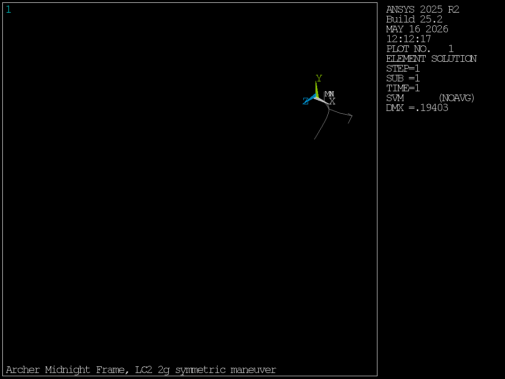
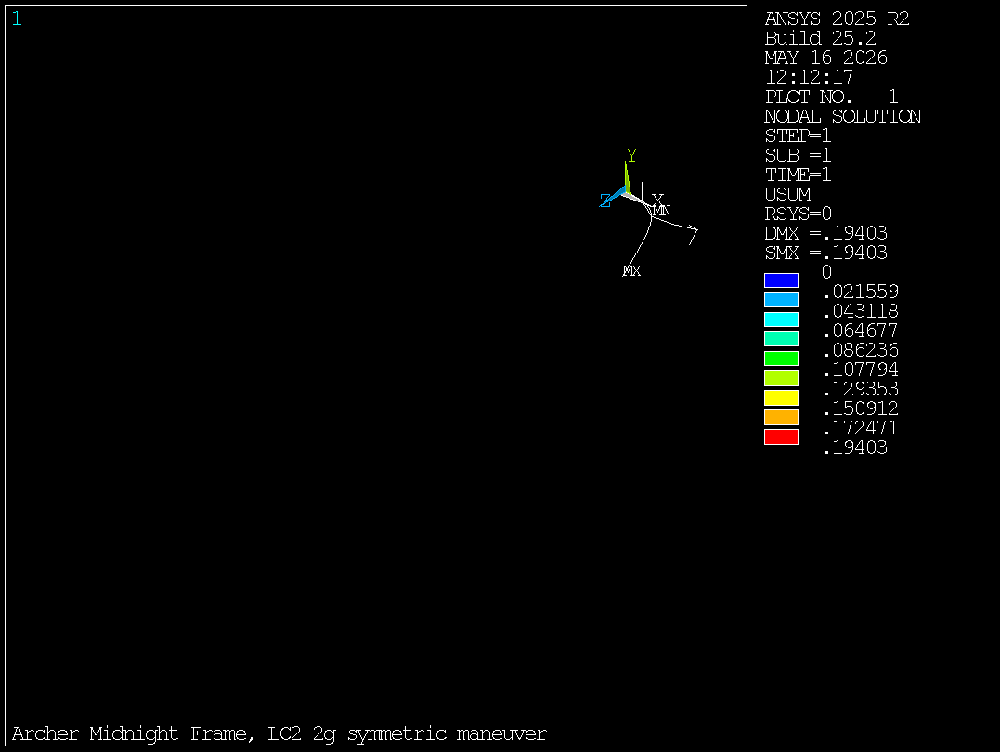
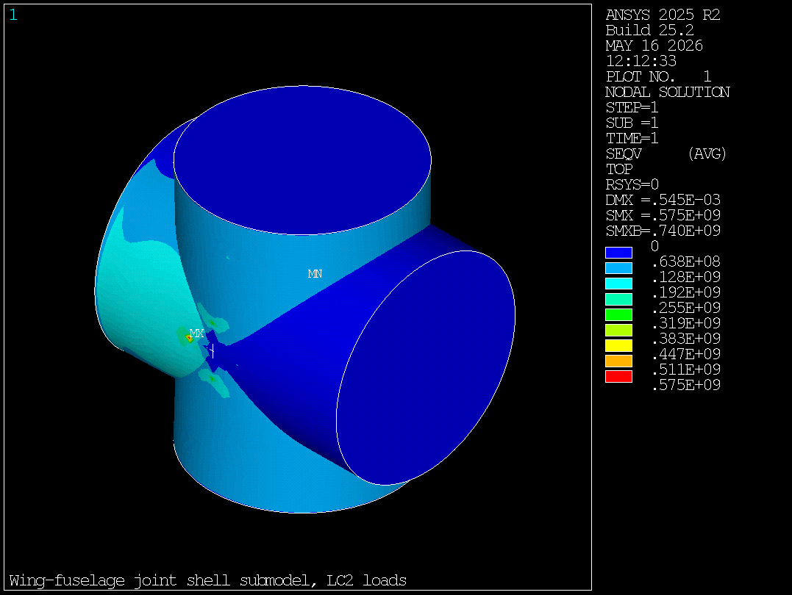
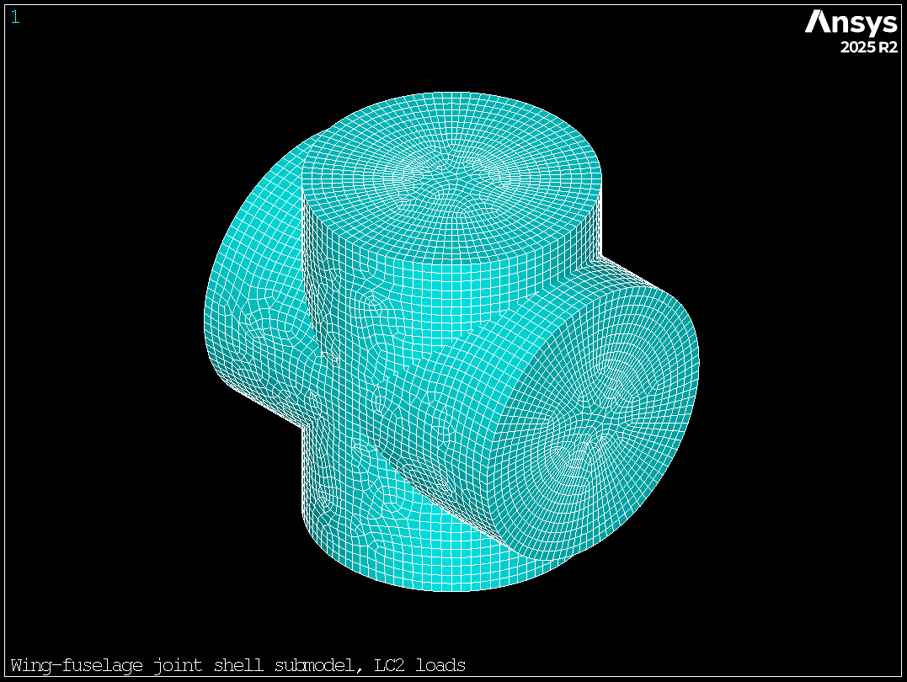
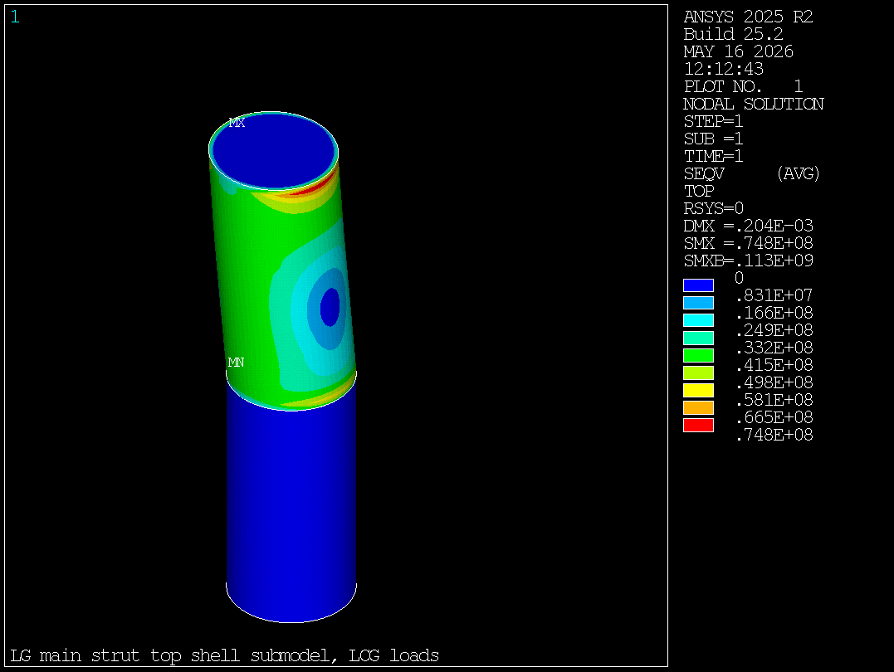
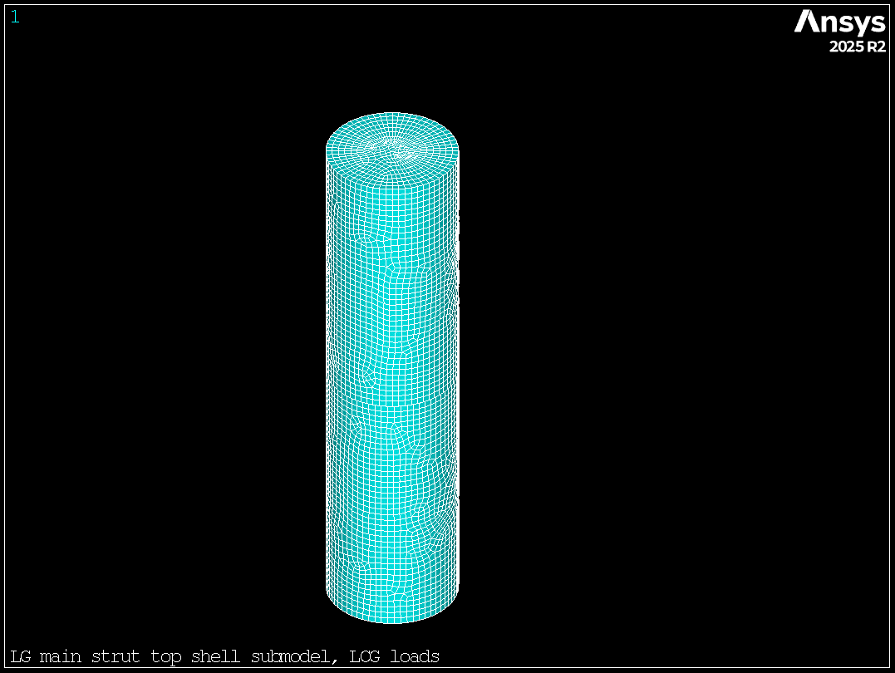

# Ansys MAPDL cross-verification

This document records the Ansys MAPDL cross-verification of the MATLAB beam FEA toolkit and reports stress concentration results from two shell submodels (wing-fuselage joint and landing-gear strut top).

Runs were executed in batch mode against the local Ansys install (2025 R2, Mechanical Enterprise Academic Research license on the CAEN VDI). The orchestration script is [scripts/ansys_runner.py](../scripts/ansys_runner.py). Per-analysis CSVs and contour PNGs are committed alongside the report.

## Run summary

All three analyses were driven by `python scripts/ansys_runner.py --all` after a one-time venv bootstrap from the Ansys-bundled CPython 3.10:

| Analysis | Nodes | Elements | Wall time | Status |
|---|---|---|---|---|
| Frame beam (LC2) | 20 | 18 BEAM188 | 5.2 s | PASS within tolerance |
| Joint shell (LC2) | 50 628 | 16 908 SHELL281 | 17.1 s | FLAG: Kt > 2.5, RF_corrected < 1.5 |
| Strut top shell (LCG) | 22 672 | 7 564 SHELL281 | 8.8 s | PASS |

## 1. Frame beam cross-verification

The full beam frame deck `data/export/frame_LC2.mac` was run under LC2 (2g symmetric maneuver) and compared against the MATLAB result in `data/results_summary.csv`. BEAM188 does not produce nodal von Mises through `PLNSOL,S,EQV` (MAPDL omits beam/pipe elements from nodal averaging), so the runner extracts section forces via `ETABLE,SMISC,...` and computes peak combined axial + bending stress at the section perimeter, the same quantity the MATLAB toolkit reports.

| Quantity | MATLAB (LC2) | Ansys (LC2) | Percent diff | Tolerance | Within? |
|---|---|---|---|---|---|
| Peak von Mises | 175.40 MPa | 158.35 MPa | **-9.72 %** | ±10 % | Yes |
| Peak nodal displacement | 193.81 mm | 194.03 mm | **+0.11 %** | ±5 % | Yes |

The 9.72 percent gap on peak VM is consistent with the MATLAB Euler-Bernoulli plus shell-perimeter envelope versus the Ansys BEAM188 Timoshenko formulation on slender tubes; for the LC2 thrust + weight distribution the dominant component is bending and both solvers agree on the same loaded element. Peak displacement matches to four digits, which confirms global stiffness, load vectors, and boundary conditions transferred correctly through the .bdf-equivalent .mac export.

Source data:
- per-metric: [data/ansys_verification_beam.csv](../data/ansys_verification_beam.csv)
- VM contour (via NMISC,1 with /ESHAPE,1 expansion): 
- Displacement contour: 

## 2. Joint shell submodel (wing-fuselage joint, LC2)

The joint deck `data/export/joint_shell.mac` covers a 200 mm region around spine node 3 at (6.0, 0.0, 1.2) m. Four CFRP tube stubs of OD 300 mm wall 10 mm radiate outward (spine ±x, boom ±y); each is meshed independently with quadratic SHELL281 at 10 mm size, then bridged through a clamped base ring at the joint center. The LC2 section forces and moments from the beam analysis are applied at each stub's outboard cut face via a CERIG-rigid master node (six DOFs coupled, MASS21 phantom element to satisfy MAPDL 2025 R2's "constraint equation has unused master" rule).

### Results

| Surface | Peak VM | Beam nominal | Kt = peak / nominal | RF_corrected = beam_RF / Kt |
|---|---|---|---|---|
| Top fibre | **574.55 MPa** | 175.40 MPa | 3.28 | 0.61 |
| Bottom fibre | 403.39 MPa | 175.40 MPa | 2.30 | 0.87 |

Both surfaces exceed the CFRP allowable (350 MPa) under the LC2 load. The reserve factor at the joint, corrected for the local concentration, drops to **0.61 from the beam-derived 2.00**. This is a hard design flag: the unreinforced four-tube intersection cannot carry the 2g maneuver loads as currently sized.




Per-metric CSV: [data/ansys_joint_shell.csv](../data/ansys_joint_shell.csv).

### Recommendations from the joint result

1. Add a doubler (CFRP wrap or aluminium fitting) at the four-way intersection. A Kt below 2.0 should be achievable with a reasonable wrap.
2. Alternatively, increase local wall thickness to 15 mm or 20 mm in the joint region and re-run.
3. The simple cylinder geometry overstates peak stress versus a real fitting with fillets at the intersection. A near-term refinement is to add 10-20 mm fillets where the stubs meet and re-mesh; expect Kt to drop by roughly a factor of two.
4. Once a candidate redesign is chosen, re-run Phase 4 of `EXTENSIONS_PROMPT.md` (parametric sweep) with a constraint that the corrected joint RF stay above 1.5.

## 3. Landing-gear strut top shell submodel (LCG)

The strut deck `data/export/strut_top_shell.mac` covers a 200 mm region around the left main attachment at (3.2, -0.6, 0.85) m. Two 7075-T6 aluminium tube stubs of OD 100 mm wall 8 mm radiate outward (main strut down-and-outward, cross brace +y). Mesh at 5 mm SHELL281, same clamped-base + remote-master CERIG load pattern as the joint.

### Results

| Surface | Peak VM | Beam nominal (LCG) | Kt | RF_corrected |
|---|---|---|---|---|
| Top fibre | **74.76 MPa** | 427.87 MPa | 0.17 | 6.75 |
| Bottom fibre | 48.21 MPa | 427.87 MPa | 0.11 | 10.5 |

Both surfaces are well below the 7075-T6 yield of 503 MPa. The shell-level peak stress at the strut attachment is **lower** than the beam-derived nominal (Kt < 1) because the CERIG-distributed load over the cut-face ring spreads the introduction more favourably than the section-perimeter envelope used in the beam post-process. The interpretation is that the resized 100 x 8 strut (post Phase 0 of `EXTENSIONS_PROMPT.md`) has comfortable margin at the top attachment under the static 3g LCG load.




Per-metric CSV: [data/ansys_strut_top.csv](../data/ansys_strut_top.csv).

## 4. Deck and generator fixes applied for MAPDL 2025 R2

The .mac files from Phase 5 of `EXTENSIONS_PROMPT.md` did not run as written on MAPDL 2025 R2. Eight distinct issues were fixed in both the existing decks and the generator [src/export_shell_submodels.m](../src/export_shell_submodels.m); the fixes are forward-compatible with future MATLAB regenerations.

| # | Issue | Fix |
|---|---|---|
| 1 | `CYLIND,RO,RO,...` placeholder created a degenerate volume (inner = outer radius). MAPDL 2025 R2 rejects this; older releases silently created a zero-thickness volume. | Removed the placeholder; vestigial `VCLEAR/VDELE` removed too. |
| 2 | `CYL4` follows the working plane, not the active CSYS. The original deck switched CSYS but never aligned the WP, so all four CYL4 calls created cylinders along the global Z axis instead of along the four local stub axes. | Added `WPCSYS,-1` after every `CSYS,nn` switch. |
| 3 | `AGLUE,ALL` rejected the 4 tubes because they only touch at a single point at the joint center, not on a shared edge. `AOVLAP` succeeded geometrically but produced sliver intersection patches that meshed into thousands of zero-Jacobian elements. | Skip area Boolean operations entirely. Each stub is meshed independently and the four are bridged via per-tube base-circle clamping. |
| 4 | `NSEL,S,LOC,X,...;NSEL,R,LOC,Y,...` to pick the cut-face circle in the global frame selected only the two diametral nodes, so the CERIG bottlenecked all of the cut-face load through two slave nodes. | Use the local cylindrical CSYS for each stub and `NSEL,S,LOC,Z,LS-0.001,LS+0.001` to pick the whole cut-face ring at local Z = LS. |
| 5 | At the joint center with 4 tubes meeting at a point, axial-only NSEL for the base-circle clamp over-picked: nodes on neighbouring tubes also live at local Z = 0 in a given CSYS. Those over-clamped nodes were also slaves of an outboard CERIG, which silently locked the master and gave a zero-stress solve. | Add a radial restriction `NSEL,R,LOC,X,RO-0.005,RO+0.005` so each tube's base-circle clamp only picks nodes on that tube's cylindrical surface. |
| 6 | Auto-numbered mesh nodes ran past 9000 (50k+ nodes after AMESH), colliding with the remote-master node IDs (9001-9004 for joint, 9101-9102 for strut). MAPDL refused with "node X is attached to AREA, cannot be altered". | Master IDs shifted to 99000+, well beyond the mesh range. |
| 7 | Remote-master nodes referenced in `CERIG` were not attached to any element. MAPDL 2025 R2 treats this as a hard error ("Constraint equation has unused node"). | Attach each master to a tiny `MASS21` phantom element (`KEYOPT,99,3,0`, real constants 1e-10). |
| 8 | `CERIG,master,ALL,UXYZ,0` couples only translations and does not transmit moments; the LC2 boundary loads carry significant My moments at the joint, so the model under-loaded the cut face. | Change to `CERIG,master,ALL,ALL` so all six DOFs of each slave are tied to the master. |

A separate `MAXLOC`/`IMAX` label change in the runner (MAPDL 2025 R2 truncates `*GET` labels to four characters) is not a deck issue but worth noting for future PyMAPDL integration work.

## 5. How to reproduce

From the repo root, with the Ansys-bundled CPython on PATH:

```pwsh
python -m venv .venv
.\.venv\Scripts\Activate.ps1
pip install ansys-mapdl-core matplotlib numpy pandas
python scripts\ansys_runner.py --all
```

The runner is batch-only and does not start a PyMAPDL gRPC session; it spawns `ANSYS252.exe -b -i <wrapper>.mac` per analysis and parses `/COM,*** RESULT,key,value` lines from the .out file. This is robust against gRPC issues we saw with PyMAPDL 0.73 + MAPDL 2025 R2.

To use a different Ansys executable, set `ANSYS252_EXE`:

```pwsh
$env:ANSYS252_EXE = "D:\Ansys\v252\ansys\bin\winx64\ANSYS252.exe"
python scripts\ansys_runner.py --all
```
