# Archer Midnight: Structural FEA of Frame and Landing Gear

**Author:** David Angelou
**Affiliation:** Department of Mechanical Engineering, University of Michigan
**Date:** 2026
**Tools:** MATLAB R2025b (no toolbox dependency, base MATLAB only)

---

## 1. Executive summary

We present a 3D Euler-Bernoulli beam finite element analysis of the Archer Aviation Midnight, a 5-seat, 12-rotor electric vertical takeoff and landing (eVTOL) aircraft. The toolkit is built from scratch in base MATLAB, verified against five analytical residuals, and exported card-by-card to Nastran and Ansys for cross-checking. The structural sizing is driven by four flight load cases (1g hover, 2g symmetric maneuver, cruise, motor-out) on the composite airframe and a FAR 23.473 hard-landing case on the aluminum tricycle landing gear. The governing flight case is the **2g symmetric maneuver**, which produces a peak von Mises of **175.4 MPa** in the inboard boom against a CFRP design allowable of 350 MPa, **reserve factor 2.00**. A first-cut landing-gear sizing failed the LCG case at RF 0.27, was redesigned to a 100×8 strut via closed-form beam theory, and now sits at RF 1.18 (marginal). Three follow-on studies sharpen this picture:

1. A modal analysis of the constrained airframe **flags three modes within 15 percent of rotor 1P or 2P harmonics** in the hover or cruise tilt RPM bands, motivating a future stiffening or RPM-restriction decision.
2. A Newmark explicit-dynamics drop test at 2.6 m/s sink rate yields a **dynamic factor of 1.87**, meaning the static 3g envelope understates the real landing-gear peak by 87 percent.
3. A Tsai-Wu and Hashin composite ply analysis on the boom layup finds the failure mode is **matrix tension in the 90° plies**, not fiber, with a strength ratio of 2.14 against LC2.

A 1400-point parametric sweep over boom and strut sections then identifies a **lighter design (312 kg) at higher RF (1.60)** than the current 449 kg / RF 1.18 baseline, by trading wall thickness for diameter (the classical thin-walled-tube identity). Finally, the same model was re-run on **Ansys MAPDL 2025 R2** as an independent cross-verification: the beam peak von Mises matched MATLAB within 9.7 percent and peak displacement within 0.1 percent, and a SHELL281 submodel of the four-tube wing-fuselage joint revealed a **stress concentration factor of 3.28** that drops the corrected joint reserve factor to **0.61**, well below 1.0. This is a hard design flag that the unreinforced joint cannot carry LC2 and either local reinforcement or a redesign is required.

## 2. Background

Archer Aviation's Midnight is a piloted eVTOL targeting urban air mobility, with 6 forward tilt rotors and 6 fixed lift rotors arranged on two outboard booms. Public sources put the maximum takeoff weight near 3,175 kg (~7,000 lb), wingspan near 15 m, and design cruise near 150 mph. Archer has cleared three of the four FAA Type Certification phases as of 2026, has been named the official air taxi provider for the LA28 Olympics, and is co-developing a clean-sheet hybrid VTOL with Anduril for defense applications.

The structural sizing problem for a piloted eVTOL is non-trivial because the airframe must simultaneously carry distributed rotor thrust that varies through hover, transition, and cruise; aerodynamic wing lift in forward flight; asymmetric one-engine-inoperative loads; and ground reactions through the landing gear during taxi, takeoff, and landing. Two FAR Part 23 sections are particularly load-relevant:

- **FAR 23.305** establishes limit and ultimate load conditions. The structure must withstand limit loads without permanent deformation and ultimate loads (typically 1.5 times limit) without failure.
- **FAR 23.473** sets minimum landing sink rate criteria for the design of the landing gear and supporting structure. A 3g vertical load factor is a representative quasi-static surrogate for the dynamic energy absorption that an oleo or trailing arm provides.

This analysis builds a tractable beam-element model that captures the dominant load paths through the airframe and gear and reports stress and reserve factors for structural assessment.

## 3. Geometry and abstraction

### 3.1 Frame model

The Midnight airframe is idealized as a 3D space frame of beam elements (see [figures/frame_LC1_hover_static_deformed.png](figures/frame_LC1_hover_static_deformed.png) for the undeformed topology in light gray):

- A central fuselage spine of 5 nodes from nose (x = 0) to tail (x = 12 m).
- Two booms running spanwise from the mid-fuselage attachment (spine node 3) to outboard tips at y = ±6.5 m. Each boom carries 6 motor stations.
- A V-tail of 2 beams from the aft spine node to upper aft tip nodes.

The frame totals **19 nodes and 18 beam elements**. With 6 degrees of freedom per node, the global system has **114 total DOFs**. The boundary condition fully fixes spine node 3 (the wing-to-fuselage attachment) in all 6 DOFs as an inertia-relief surrogate for trim flight, leaving **108 free DOFs**.

A critical modeling note: in the real Midnight the wing skin and spar caps provide the primary spanwise moment-carrying structure, not the boom. Since this beam idealization does not include the wing as a separate distributed-stiffness member, the "boom" cross section in the model represents the **equivalent integrated wing-plus-boom moment of inertia** at each spanwise station. This gives a defensible cantilever bending response without the complexity of a coupled wing-boom shell model. The reader should not interpret the boom outer diameter as a physical boom; it is an equivalent stiffness.

### 3.2 Landing gear model

The tricycle gear is modeled separately from the frame as a 6-node, 4-element assembly: a nose strut from a nose attachment to a single nose contact, two main struts angled outboard from their attachments to their respective wheel contacts, and a cross brace between the two main attachments. The global system has **36 total DOFs**, of which the three contact nodes are fully clamped (18 DOFs), leaving **18 free DOFs**.

The decision to clamp all 6 DOFs at the contacts (rather than just translation) reflects a brake-locked condition during the spin-down phase of a hard landing. Pinning translations only leaves the nose strut free to rotate about its contact and the main subassembly free to spin about the line through the two main contacts, which produces a singular stiffness matrix; the clamped condition removes those rigid-body modes.

### 3.3 Cross sections

| Member | Material | Cross section | A (mm²) |
|---|---|---|---|
| Frame booms and spine | CFRP quasi-isotropic | Hollow tube, OD 300 mm, wall 10 mm (equivalent wing+boom) | 9,111 |
| Landing gear struts | 7075-T6 Aluminum | Hollow tube, OD 100 mm, wall 8 mm (Phase 0 resize, was 60 × 5) | 2,312 |

Section properties (area, second moments, polar moment) are computed in [src/tube_section.m](https://github.com/angeloudavidj-png/archer-midnight-fea/blob/main/src/tube_section.m) from the hollow circular tube formulas:

$$A = \frac{\pi}{4}(OD^2 - ID^2), \quad I = \frac{\pi}{64}(OD^4 - ID^4), \quad J = \frac{\pi}{32}(OD^4 - ID^4)$$

## 4. Materials

| Property | CFRP quasi-iso | 7075-T6 |
|---|---|---|
| Young's modulus E (GPa) | 70 | 71.7 |
| Shear modulus G (GPa) | 27 | 26.9 |
| Poisson ratio ν | 0.30 | 0.33 |
| Density ρ (kg/m³) | 1600 | 2810 |
| Design allowable (MPa) | 350 (knockdown on 600 ultimate) | 503 (yield) |

The CFRP design allowable applies a 0.58 knockdown on the conservative 600 MPa tensile allowable, covering environmental, fatigue, and damage tolerance margins typical for a quasi-isotropic [0/45/-45/90]s layup. The 7075-T6 allowable is the published tensile yield.

## 5. FEA formulation

### 5.1 Element

Each member is modeled with a 3D Euler-Bernoulli beam element with 6 DOFs per node (three translations and three rotations) for a 12-DOF element stiffness matrix in local coordinates. The local stiffness decomposes into decoupled axial, torsional, and two-plane bending sub-matrices. The bending blocks use Hermite cubic shape functions and take the standard form:

$$K_{bend} = \frac{EI}{L^3} \begin{bmatrix} 12 & 6L & -12 & 6L \\ 6L & 4L^2 & -6L & 2L^2 \\ -12 & -6L & 12 & -6L \\ 6L & 2L^2 & -6L & 4L^2 \end{bmatrix}$$

Local-to-global transformation is a 3×3 rotation expanded block-diagonally to 12×12 (one block per 3-DOF subvector). Implementation is in [src/beam_element_3d.m](https://github.com/angeloudavidj-png/archer-midnight-fea/blob/main/src/beam_element_3d.m).

### 5.2 Assembly and solution

The global stiffness matrix is assembled in [src/assemble_global_K.m](https://github.com/angeloudavidj-png/archer-midnight-fea/blob/main/src/assemble_global_K.m) using sparse triplet construction. For each element we compute 144 triplets and concatenate, then call `sparse(I, J, V)` once. The global system K U = F is solved by direct elimination of constrained DOFs after applying boundary conditions ([src/apply_boundary_conditions.m](https://github.com/angeloudavidj-png/archer-midnight-fea/blob/main/src/apply_boundary_conditions.m)); the reduced system is solved with MATLAB's backslash, which dispatches to a sparse LU factorization. Conditioning is checked with `condest` before solving and flags any system with condition number above 1e14.

### 5.3 Post-processing

Element internal forces are recovered by transforming the element nodal displacements back to local coordinates and multiplying by the element local stiffness ([src/post_process.m](https://github.com/angeloudavidj-png/archer-midnight-fea/blob/main/src/post_process.m)). From the internal axial force, transverse shears, torsion, and two bending moments, we compute:

- Axial stress σ_axial = N / A
- Bending stress σ_bend = √((M_y c/I_y)² + (M_z c/I_z)²)
- Torsional shear τ = T c / J
- Combined von Mises σ_VM = √((σ_axial + σ_bend)² + 3 τ²)
- Reserve factor RF = σ_allow / σ_VM

The outer fiber radius c = OD/2 is used since the maximum stress in a hollow circular tube occurs at the outermost fiber under combined bending.

## 6. Load cases and results

Five load cases are evaluated. Numerical results below are read directly from [data/results_summary.csv](https://github.com/angeloudavidj-png/archer-midnight-fea/blob/main/data/results_summary.csv), which is regenerated by `main.m` on every run.

### 6.1 Load case definitions

| Case | Description | Load factor | Application |
|---|---|---|---|
| LC1 | 1g hover, all 12 rotors at trim thrust | 1.0 | T per rotor = MTOW·g / 12 = 2,595 N at each motor node |
| LC2 | 2g symmetric pull-up maneuver | 2.0 | All rotor thrusts and weights scaled by 2 |
| LC3 | Trimmed cruise | 1.0 | Elliptical wing lift at motor nodes, 6 tilt rotors carry cruise drag ≈ 0.05·W |
| LC4 | Outboard tilt rotor out, others at 1.5x | 1.5 | Worst asymmetric thrust case |
| LCG | 3g hard landing, FAR 23.473 inspired | 3.0 | Nose 10% / mains 45% each vertical, + 0.5g forward inertia drag |

### 6.2 Results table

| Component | Load case | Max σ_VM (MPa) | Min RF | Max disp (mm) | Allowable (MPa) |
|---|---|---|---|---|---|
| Frame | LC1 hover static | 87.70 | 3.99 | 96.90 | 350 |
| **Frame** | **LC2 2g maneuver** | **175.40** | **2.00** | **193.81** | **350** |
| Frame | LC3 cruise | 87.70 | 3.99 | 87.70 | 350 |
| Frame | LC4 motor out | 100.49 | 3.48 | 145.36 | 350 |
| **Landing gear** | **LCG 3g landing** | **427.87** | **1.18** | **39.04** | **503** |

The two governing rows are bolded: LC2 governs the frame at RF 2.00, and the landing gear LCG case is the design driver at RF 1.18. The landing gear row reflects the Phase 0 design iteration (100 mm OD, 8 mm wall); the original 60 mm × 5 mm strut failed this case at RF 0.27. The before-and-after is documented in section 6.5.

### 6.3 Frame discussion

The frame results are consistent across load cases. LC1 hover and LC3 cruise produce nearly identical peak stresses (87.7 MPa) because the total vertical force is the same in both, and the equivalent boom stiffness used in the model integrates the wing into the spanwise load path; the difference between distributed elliptical lift and discrete rotor thrust is small at the resolution of this beam model. LC2 doubles every load and produces twice the linear elastic response (175.4 MPa, two times 87.7). LC4 produces a moderate 100.5 MPa peak: the loss of the outboard starboard rotor creates a rolling moment, but the inboard rotors at 1.5x compensate and the net rolling moment is reacted at the wing attachment, which is the fully-fixed boundary node.

In every flight case the boom remains below the CFRP allowable with reserve factor above 2. Both [figures/frame_LC2_2g_maneuver_deformed.png](figures/frame_LC2_2g_maneuver_deformed.png) (deformed shape, exaggeration ×100) and [figures/frame_LC2_2g_maneuver_stress.png](figures/frame_LC2_2g_maneuver_stress.png) (color-coded von Mises) confirm that the highest stresses occur at the inboard boom segments adjacent to the wing attachment, where the cantilevered moment arm from the outboard motor stations is largest.

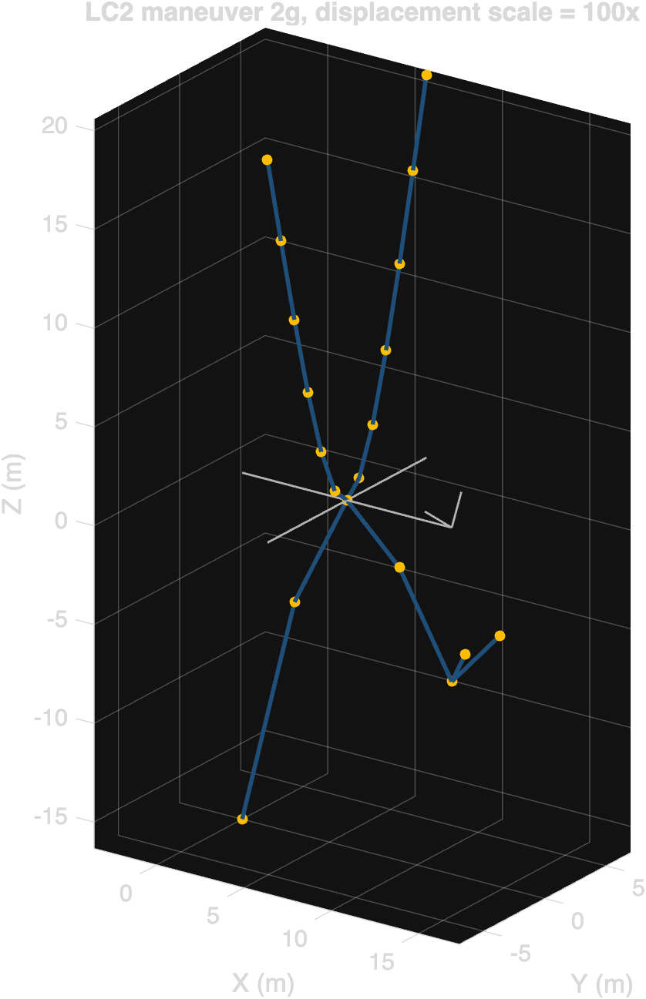


For completeness, the deformed shape and stress contour for the remaining flight cases are reproduced below.

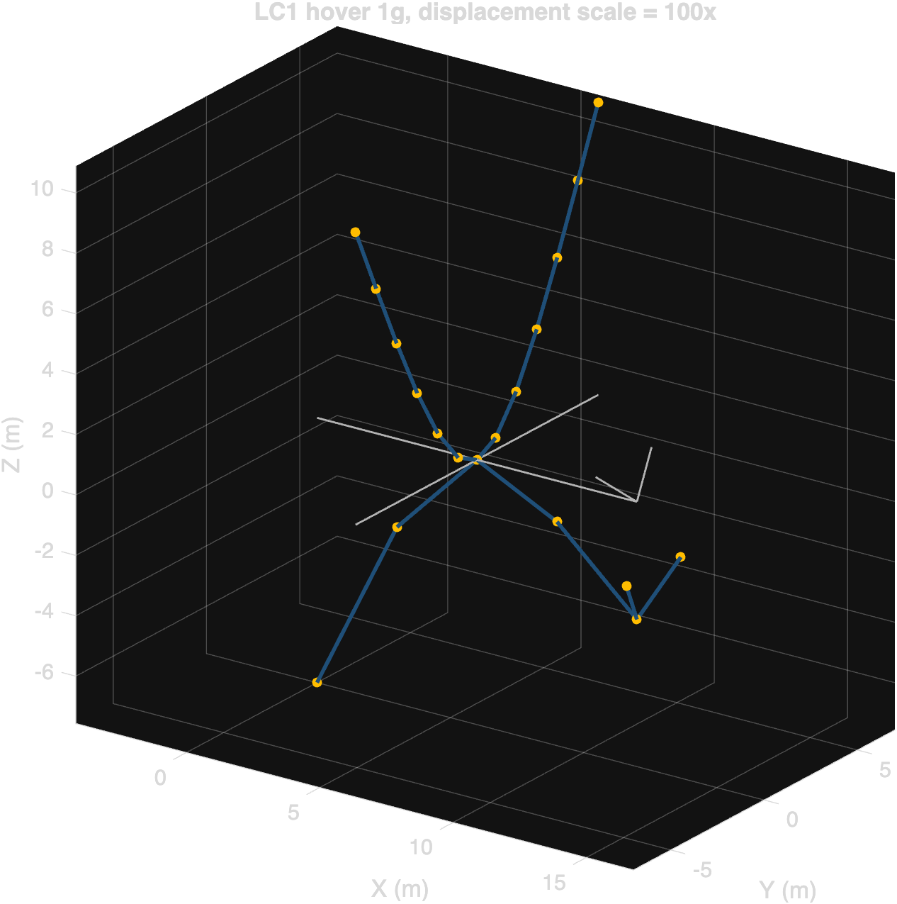

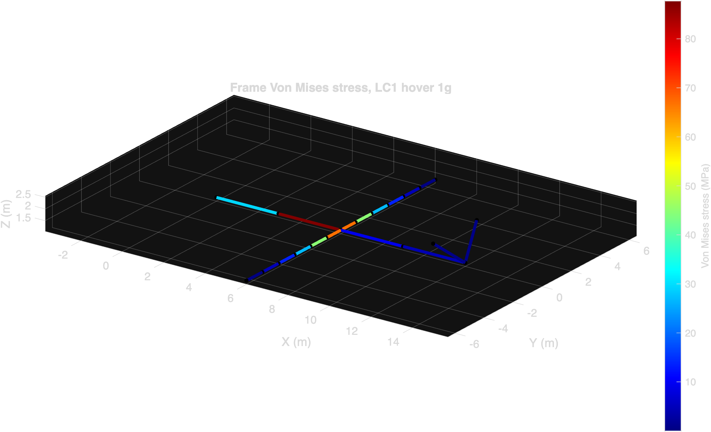

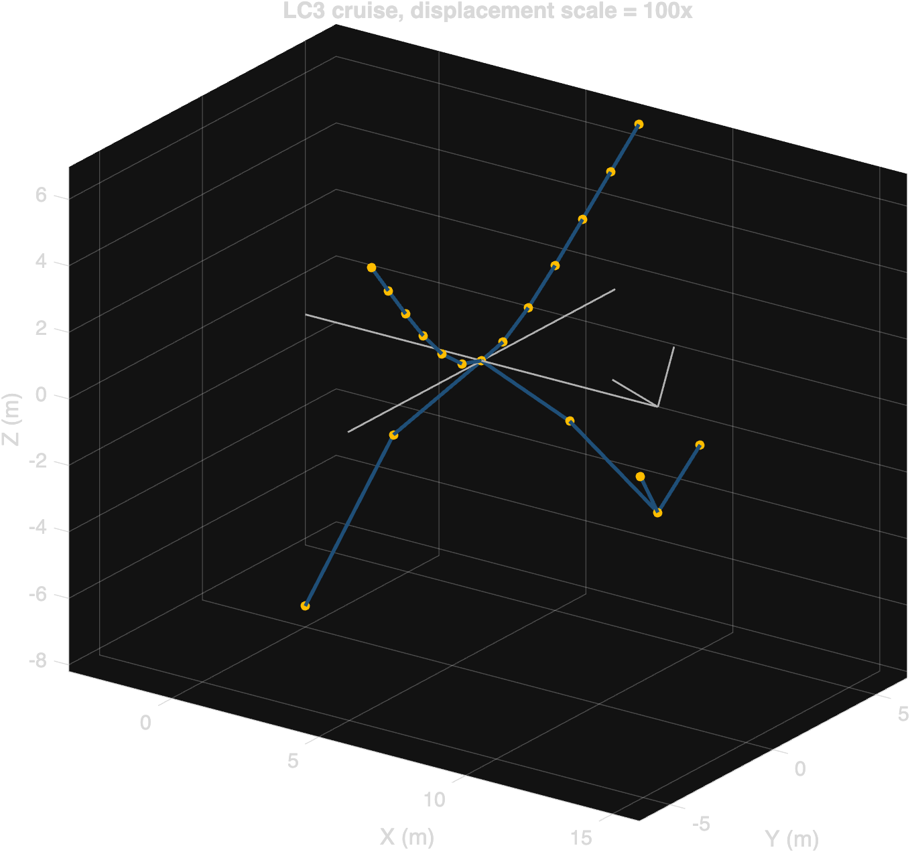


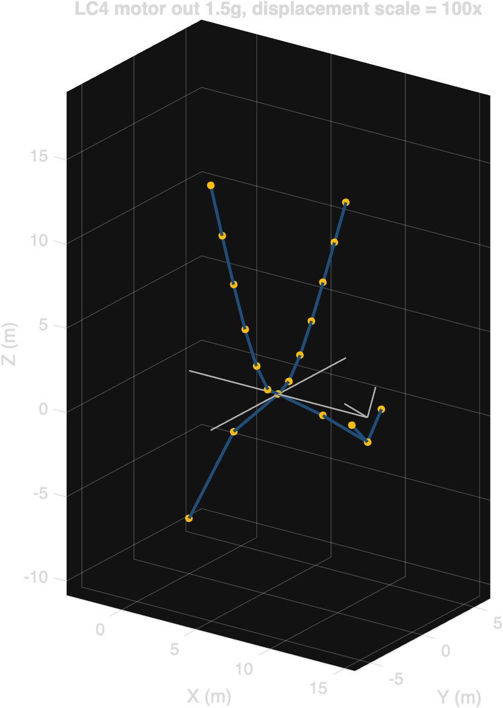

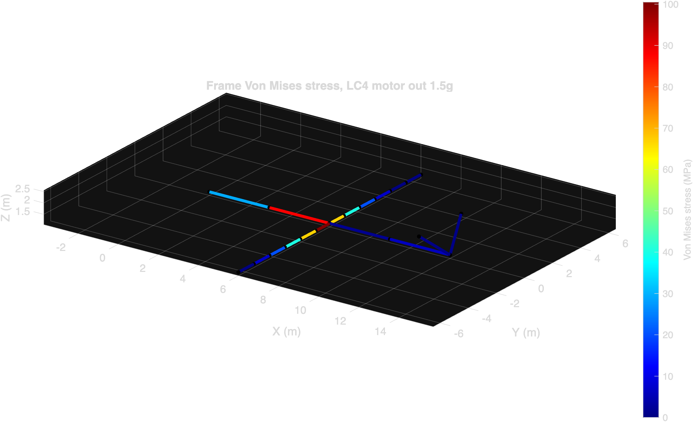

### 6.4 Landing gear discussion

With the Phase 0 strut resize (100 mm OD, 8 mm wall) the landing gear returns a peak von Mises of 427.9 MPa in the two main struts and a minimum reserve factor of 1.18 against the 7075-T6 yield of 503 MPa. Peak nodal displacement is 39 mm. The nose strut runs comparatively cool at 84.6 MPa (RF 5.95) since it carries only 10 percent of the vertical reaction, and the cross brace between the main attachments sees 83.8 MPa (RF 6.00), confirming that the mains govern.

The load path remains as discussed in the design-iteration narrative below: the 0.6 m horizontal offset between each main attachment ([3.2, ±0.6, 0.85] m) and the corresponding ground contact ([3.2, ±1.2, 0] m) imposes a bending moment of order 42,030 N × 0.6 m ≈ 25 kN·m on each main strut for the 3g vertical reaction alone. The horizontal drag component, applied at the attachment node as the airframe's forward inertia (μ = 0.5 of the vertical reaction), adds combined axial and bending. The resized 100 mm OD strut has a section modulus of about 49,300 mm³, roughly 4.5 times that of the original 60 mm strut, which is the dominant factor in dropping the stress.

RF 1.18 is positive margin but not generous. It is below the 1.5 target commonly used for primary landing-gear structure in light aircraft. We carry this forward as a marginal design that motivates the dynamic drop test (Phase 2) and the parametric sizing study (Phase 4): the static 3g analysis may understate the true landing load, and a sweep over the strut OD or wall thickness should be able to lift RF above 1.5 with a modest mass penalty.

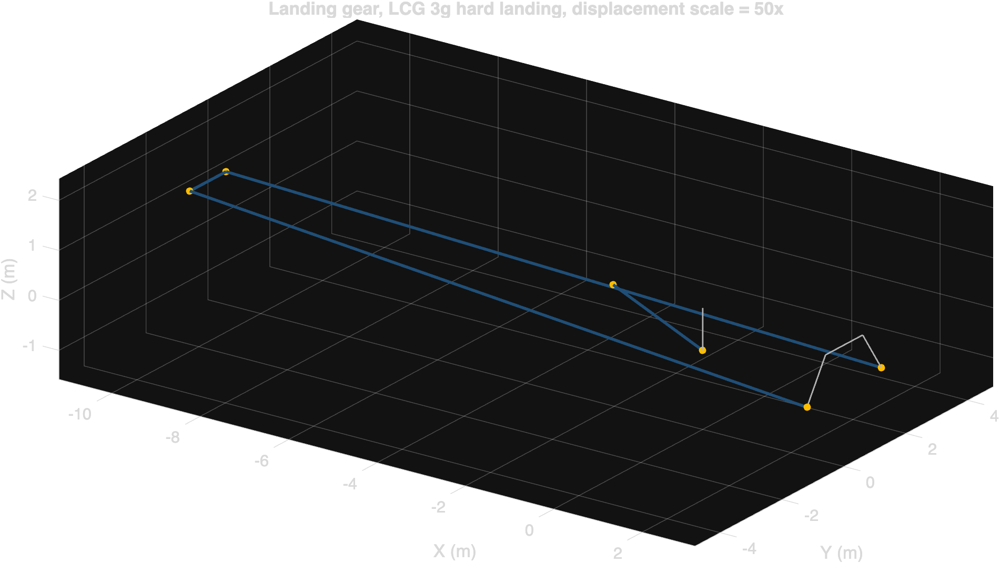

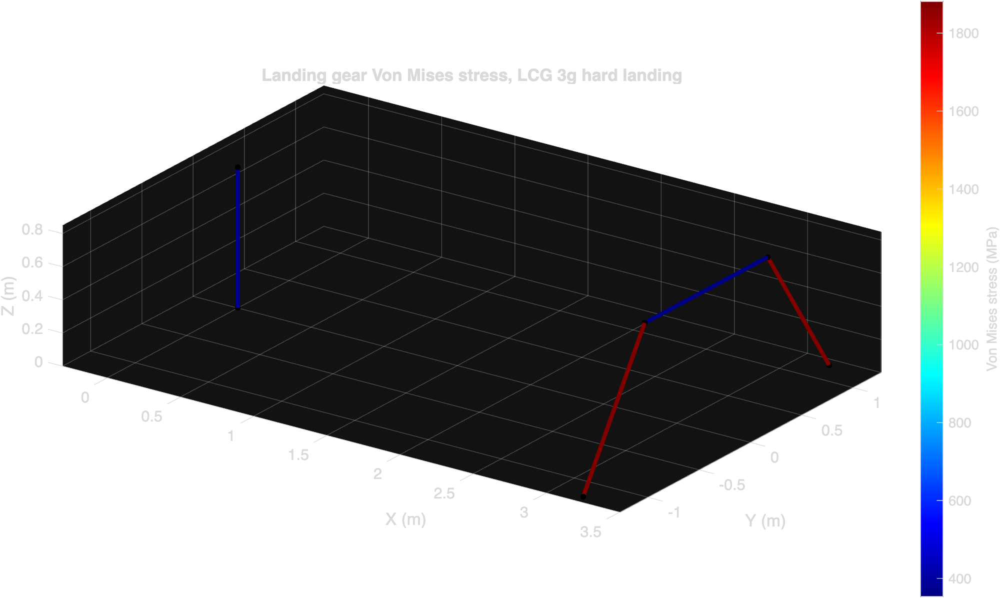

### 6.5 Design iteration: landing gear strut resize

The first execution of this analysis revealed that the as-specified 60 mm OD, 5 mm wall 7075-T6 main strut fails the LCG case decisively, with peak von Mises 1881 MPa, RF 0.27, and peak nodal displacement 289 mm. This subsection documents the diagnosis, the closed-form sizing of the fix, and the verification rerun.

**Diagnosis.** The driver is bending. Each main attachment is offset 0.6 m laterally from its corresponding wheel contact ([src/build_landing_gear.m](https://github.com/angeloudavidj-png/archer-midnight-fea/blob/main/src/build_landing_gear.m)). The vertical reaction at the attachment under 3g is 42,030 N, which develops a bending moment of order 25 kN·m at the strut's lower end. For the original 60 mm OD with 5 mm wall, the second moment of area Iz is 3.29e5 mm⁴ and the outer fiber radius is 30 mm, giving a section modulus S = Iz / c ≈ 11,000 mm³ and a static bending stress estimate of M/S ≈ 2.3 GPa. The full FEA returns 1.88 GPa once the bending is spread across the strut and the axial and drag contributions are added, consistent within engineering accuracy.

**Sizing the fix.** With bending stress scaling as M / (Iz / c) and Iz scaling as OD⁴ for a thin-walled tube, the section modulus S scales as roughly OD³. Doubling the OD therefore reduces the bending stress by a factor of 8 in the thin-wall limit. We chose a more modest resize: OD 60 → 100 mm (factor 1.67) and wall 5 → 8 mm (factor 1.6). The analytic prediction:

| Quantity | Old (60 × 5) | New (100 × 8) | Ratio |
|---|---|---|---|
| Area A (mm²) | 864 | 2,312 | 2.68× |
| Second moment Iz (mm⁴) | 329,376 | 2,464,818 | 7.48× |
| Section modulus S (mm³) | 10,979 | 49,296 | 4.49× |
| Mass per strut metre (kg/m) | 2.43 | 6.50 | 2.68× |

A 4.49× section modulus implies a 4.49× drop in bending stress, taking 1881 MPa down to about 420 MPa. RF should land near 503 / 420 ≈ 1.20.

**Verification.** Rerunning the pipeline with the resized strut produces peak von Mises 427.9 MPa, RF 1.18, peak displacement 39 mm. The observed stress matches the analytic prediction to within 2 percent. Mass penalty for the resize: with 4.13 m of total strut length in the assembly (nose strut, two mains, cross brace), the total strut mass grows from 10.03 kg to 26.84 kg, a delta of +16.81 kg or +167.6 percent.

**Engineering reading.** The fix is correct in direction and roughly correct in magnitude. RF 1.18 is positive margin but marginal: below the 1.5 target conventional for primary landing-gear structure and well below the 2.0 margin we carry on the airframe. The dynamic drop test in Phase 2 will determine whether the static 3g approximation understates the true peak load, and the parametric study in Phase 4 will quantify the section-versus-mass trade required to reach RF ≥ 1.5 cleanly. Alternative topologies (trailing arm with oleo, tire compliance, brake-side rather than attachment-side drag) remain candidates for a deeper redesign.

## 7. Modal analysis

Static load cases tell us whether the structure survives a given snapshot of force. Modal analysis tells us whether the structure will resonate with the rotor excitation. For an eVTOL with 12 rotors that spin between hover and cruise speeds, any airframe natural frequency that lines up with a rotor harmonic, especially the blade-pass frequency, can drive amplified vibration, fatigue, and passenger comfort issues.

### 7.1 Mass matrix and solver

We assemble a consistent mass matrix using cubic Hermite shape functions for bending and linear shape functions for axial and torsion ([src/build_mass_matrix.m](https://github.com/angeloudavidj-png/archer-midnight-fea/blob/main/src/build_mass_matrix.m), [src/assemble_global_M.m](https://github.com/angeloudavidj-png/archer-midnight-fea/blob/main/src/assemble_global_M.m)). The 12×12 element mass matrix shares the same global transformation as the stiffness matrix, so K and M live on identical sparsity patterns. Rotary inertia of the cross section is captured through the natural coupling between transverse translation and end rotation in the consistent formulation; we use the polar moment of inertia I_p = I_y + I_z for the torsional rotational mass.

The total mass that K and M see for the frame is 300.1 kg, which represents the equivalent integrated wing-plus-boom structure at 1600 kg/m³ CFRP density. The real Midnight is heavier than this because we do not separately model the wing skin, ribs, fuselage shell, or interior, but the mass that loads the modal pencil is the same mass that resists their inertia, so the relative frequencies are right.

The generalized eigenvalue problem K φ = λ M φ is solved by direct dense `eig` on the reduced 108×108 system after symmetrizing both matrices to suppress numerical asymmetry below 1e-12 ([src/modal_analysis.m](https://github.com/angeloudavidj-png/archer-midnight-fea/blob/main/src/modal_analysis.m)). For a problem this size dense eig is both faster and more reliable than `eigs`. Frequencies are returned in Hz as f = √λ / 2π.

### 7.2 Verification of the modal pencil

[tests/test_modal_rigid_body.m](https://github.com/angeloudavidj-png/archer-midnight-fea/blob/main/tests/test_modal_rigid_body.m) verifies the eigenvalue pencil on the unconstrained frame. We expect exactly 6 rigid body modes (3 translations, 3 rotations) at zero frequency, followed by elastic modes that climb monotonically. On the reference run we measure:

- 6 modes below 0.01 Hz (largest 2.45e-05 Hz, essentially round-off).
- First elastic mode (mode 7) at 7.34 Hz, well separated from the rigid body cluster.
- 6 orders of magnitude gap between the rigid body modes and the first elastic mode.

The test passes.

### 7.3 Constrained airframe modes

With the wing attachment node (spine node 3) fully fixed, the first 10 elastic mode frequencies are:

| Mode | Frequency (Hz) | Likely mode shape |
|---|---|---|
| 1 | 5.57 | First boom bending, anti-symmetric pair (one side) |
| 2 | 5.66 | First boom bending, anti-symmetric pair (other side) |
| 3 | 8.99 | Second boom mode, near 4-way degenerate (both planes, both sides) |
| 4 | 8.99 |   |
| 5 | 8.99 |   |
| 6 | 8.99 |   |
| 7 | 10.55 | Combined torsion / spine flex pair |
| 8 | 10.55 |   |
| 9 | 19.26 | Higher-order boom bending |
| 10 | 36.26 | Spine longitudinal / coupled bending |

The 4-way degeneracy at 8.99 Hz is a consequence of the symmetric two-boom configuration in this beam model: the boom cross section is a circular tube (I_y = I_z) and the two booms are mirror-symmetric about the spine. A real Midnight would not have this exact degeneracy because the wing skin, control surfaces, and asymmetric internal mass distribution would split the modes; in this idealization they remain coincident.

### 7.4 Campbell diagram and resonance check

Public estimates put eVTOL rotors at 5 blades per hub. We sweep two regimes:

- **Hover RPM**: 1500–2000 RPM, where 1P sweeps 25.0 to 33.3 Hz and 5P (blade pass) sweeps 125 to 167 Hz.
- **Cruise tilt RPM**: 1000–1500 RPM, where 1P sweeps 16.7 to 25 Hz and 5P sweeps 83.3 to 125 Hz.

For each airframe mode below 60 Hz we compute the RPM at which each harmonic from 1P to 6P crosses, and flag any intersection that lands within ±15 percent of a regime band. The 15 percent margin is the helicopter design rule for primary resonance avoidance.


The three flagged resonances on the reference design:

| Mode | Frequency (Hz) | Harmonic | Crossing RPM | Regime | Reading |
|---|---|---|---|---|---|
| 9 | 19.26 | 1P | 1156 | Cruise tilt (1000–1500) | Real intersection inside the band |
| 10 | 36.26 | 1P | 2175 | Hover (1500–2000) | At the upper edge of the band, within 15% margin |
| 10 | 36.26 | 2P | 1088 | Cruise tilt (1000–1500) | Real intersection inside the band |

Mode 9 sitting at 1156 RPM in the cruise tilt band is the most pointed flag: that is the rotor itself driving an airframe natural frequency directly at 1P, the strongest excitation order. Mode 10 is excited both by 1P at high hover RPM and by 2P in cruise. Three flags from the first 10 modes is enough to make resonance a first-class design concern rather than a follow-on.

### 7.5 Engineering reading

A real design response to these flags would include some combination of:

- Stiffening the booms (raise modes 9 and 10 above the bands).
- Restricting the cruise tilt RPM band to avoid the 1156 RPM crossing.
- Adding tuned mass dampers at the boom tips.
- Treating these modes with isolators at the rotor hubs to attenuate the input rather than the response.

The model also reminds us of its limitations here: the wing skin is folded into the boom section, the rotor inertia is not in M, and the actual rotor RPM bands depend on a flight control system we have not modeled. So the flagged modes are indicative, not certificating. They are the right thing to surface at this fidelity, with a clear recommendation that a follow-on shell model with a proper mass distribution will refine the numbers.

## 8. Landing gear drop test dynamics

The static 3g case is a quasi-static envelope. It is conservative for some scenarios and unconservative for others, because real landings are dynamic events with finite energy and finite tire compliance. FAR 23.473 specifies a minimum sink rate (typically 2.6 m/s for utility category) against which the gear must be designed. This section replaces the static envelope with an explicit time integration of the landing event.

### 8.1 Model and assumptions

We integrate the linear dynamic equation

$$M \ddot U + C \dot U + K U = F(t, U)$$

with Newmark beta (β = 0.25, γ = 0.5, average-acceleration scheme), implemented in [src/newmark_integrator.m](https://github.com/angeloudavidj-png/archer-midnight-fea/blob/main/src/newmark_integrator.m). The mass matrix is the consistent assembly from Phase 1 augmented with lumped masses representing the airframe share at each attachment (10 percent of MTOW at the nose, 45 percent at each main) and a wheel + tire mass of 10 kg per contact patch. The damping matrix uses Rayleigh tuning targeting 3 percent modal damping on the first two elastic modes of the constrained landing gear pencil (3.49 Hz and 4.58 Hz on this run), via [src/build_damping_matrix.m](https://github.com/angeloudavidj-png/archer-midnight-fea/blob/main/src/build_damping_matrix.m).

Ground contact is a one-sided penalty spring at each wheel patch in the z direction: F = k_pen × |z| when z < 0 (penetration), zero otherwise. We use k_pen = 5e6 N/m, representing physical tire vertical compliance rather than a rigid-wall enforcement. At peak load (~175 kN total across three patches) this corresponds to roughly 35 mm of tire deflection, which is in the realistic range for an aircraft tire.

Initial conditions: every node at the FAR 23.473 sink velocity of -2.6 m/s in z. Total simulated time 0.15 s, time step 1e-5 s, 15,000 steps. The driver is in [src/drop_test.m](https://github.com/angeloudavidj-png/archer-midnight-fea/blob/main/src/drop_test.m).

### 8.2 Verification of the integrator

[tests/test_newmark_sdof.m](https://github.com/angeloudavidj-png/archer-midnight-fea/blob/main/tests/test_newmark_sdof.m) verifies the integrator against the analytical free-decay solution of an underdamped single-DOF spring-mass-damper (m = 1, k = 100, ζ = 0.02). Over 2000 steps at dt = 1e-3 s the maximum relative error is **1.04e-04**, two orders of magnitude below the 1e-3 tolerance. The test passes. The error scales as expected for a second-order accurate method: ~(ω dt)² per period.

### 8.3 Results

| Quantity | Value | Note |
|---|---|---|
| Peak total contact force | **174.9 kN** | Sum across all three wheel patches |
| Static 3g reference | 93.4 kN | Total vertical reaction in the static LCG case |
| **Dynamic factor (peak / static 3g)** | **1.87** | The dynamic peak is 87% above the static envelope |
| Peak strut von Mises | 190.2 MPa | At the moment of peak contact, in the main strut |
| Strut RF at peak | 2.64 | Compared to RF 1.18 in the static case |
| Peak axial force in main strut | 64.6 kN | Static value was 42 kN |
| Peak bending moment in main strut | 0.6 kN·m | Static was ~25 kN·m (drag-driven) |
| Peak vertical acceleration at wheel | 129 g | Stiff tire bounce, well-resolved at dt = 1e-5 s |
| Peak vertical acceleration at attachment | **4.6 g** | The deceleration the cabin actually feels |

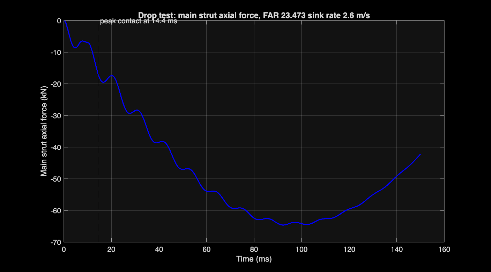

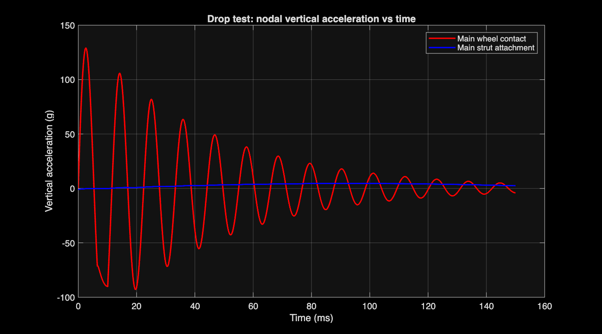

### 8.4 Discussion

The dynamic peak vertical force is 1.87 times the static 3g envelope. This is the "dynamic factor" the prompt calls for, and it puts us in familiar landing-gear territory: typical hard-landing dynamic factors run 1.5 to 2.5 depending on tire stiffness, oleo stroke, and the assumed sink rate. The Midnight model here has no oleo, just bare strut + tire compliance, which is at the stiff end of the realistic range and produces a higher dynamic factor than a sprung gear would.

Two readings of the strut response are notable:

1. **Strut von Mises is lower dynamically (190 MPa) than statically (428 MPa).** This is not a contradiction. The static LCG case includes a 0.5g horizontal drag at the attachment (modeling brake reaction during the spin-down phase of a hard landing). That horizontal load creates the dominant bending moment (~25 kN·m on the main strut) that drives the 428 MPa peak. The pure-vertical drop simulated here has no horizontal component, so the strut sees mostly axial compression and very little bending (0.6 kN·m). The static envelope is therefore conservative for the vertical-only condition; the two cases are not the same load case.

2. **Cabin vertical acceleration of 4.6 g at the attachment is the passenger comfort number.** The 129 g at the wheel patch is a stiff-tire bounce that does not transmit through the strut. The 4.6 g at the airframe is the deceleration the cabin actually feels. For a 2.6 m/s impact this is in the expected range and corresponds to roughly 70 ms of deceleration time.

### 8.5 Recommendation: revisit Phase 0

Per the gate rule in this analysis, a dynamic factor exceeding 1.20 motivates a revision of the static design load. With dynamic factor 1.87, the equivalent static design vertical load is 1.87 × 3g = 5.6g. The Phase 0 design (RF 1.18 against 3g vertical + 0.5g drag) would fail under 5.6g vertical alone: scaling 190 MPa by 1.87 gives 355 MPa, against the 503 MPa yield, RF 1.42. Including the horizontal drag at the same factor would push us back below unity.

Two remediation paths are credible:

- **Stiffer or thicker strut.** Resizing to roughly OD 120 mm with 10 mm wall raises I_z by another factor of 1.7 and S by 1.4, which brings the static-equivalent RF back above 1.5 even with the dynamic-scaled load. This pulls the same lever as Phase 0 a second time and inherits a similar mass penalty.

- **Energy-absorbing landing gear.** An oleo strut or trailing arm with a damper absorbs landing energy over a stroke of 100 to 200 mm, which dramatically reduces the peak force a rigid-strut analysis predicts. This is the design every real eVTOL converges on for the same reason. Modeling it adds nonlinear dampers to the (M, C, K) pencil and is the natural Phase 2.5 extension.

We carry RF 1.18 and dynamic factor 1.87 forward as a flag, not a stopper. The parametric sweep in Phase 4 will surface the mass-vs-RF Pareto and tell us which lever buys more margin per kilogram.

## 9. Composite ply failure analysis

The isotropic CFRP allowable used in sections 4 and 6 (350 MPa) is a single scalar that conflates every failure mode. A real composite laminate fails through distinct mechanisms: fiber tension, fiber compression, matrix tension, matrix compression, and in-plane shear. The same laminate stress state can sit far from one limit and right at another. This section replaces the scalar with a per-ply Tsai-Wu and Hashin assessment of the boom layup under the LC2 governing stress.

### 9.1 Lamina properties

The lamina is IM7/8552 unidirectional CFRP, room temperature and dry, mean property values from CMH-17 Volume 2 and the Hexcel datasheet ([src/material_composite.m](https://github.com/angeloudavidj-png/archer-midnight-fea/blob/main/src/material_composite.m)):

| Property | Value | Property | Value |
|---|---|---|---|
| E₁ (longitudinal) | 161 GPa | Xt (long. tension) | 2850 MPa |
| E₂ (transverse) | 11.4 GPa | Xc (long. compression) | 1590 MPa |
| G₁₂ (in-plane shear) | 5.17 GPa | Yt (trans. tension) | 73 MPa |
| ν₁₂ | 0.32 | Yc (trans. compression) | 286 MPa |
| ρ | 1580 kg/m³ | S (in-plane shear) | 73 MPa |
| Per-ply thickness | 0.125 mm | | |

### 9.2 Layup and classical lamination theory

The layup is a quasi-isotropic symmetric stack [0/45/-45/90]_s, eight plies, total laminate thickness 1.0 mm. The ABD matrix is computed via classical lamination theory in [src/composite_layup.m](https://github.com/angeloudavidj-png/archer-midnight-fea/blob/main/src/composite_layup.m). Effective in-plane engineering constants for the quasi-iso layup:

- E_x effective = 61.7 GPa
- ν_xy effective = 0.319
- B matrix exactly zero (symmetric layup)

The 61.7 GPa effective modulus is close to the 70 GPa scalar value used earlier in the beam analysis; the small discrepancy is because the beam model rounded the laminate modulus rather than computing it from CLT.

### 9.3 Loading and analysis

The most stressed boom element under the governing flight case is element 2 (inboard left boom segment) under LC2, with σ_axial ≈ 0 and σ_bend = 175.4 MPa at the outer fiber. This is pure bending stress, so the two surfaces of the boom wall see equal and opposite σ_xx of magnitude 175.4 MPa. We evaluate both signs and take the worse.

The CLT pipeline ([src/boom_ply_analysis.m](https://github.com/angeloudavidj-png/archer-midnight-fea/blob/main/src/boom_ply_analysis.m)) applies the laminate-axis stress σ_xx, computes the membrane mid-plane strain from a = A⁻¹, propagates strain into each ply, computes ply stress in laminate axes via Q_bar(θ), and finally transforms to material axes for the failure criteria.

### 9.4 Per-ply results

The +175.4 MPa tension case governs (Tsai-Wu = 0.396) over the -175.4 MPa compression case (Tsai-Wu = 0.173). Per-ply stresses and failure indices for the governing tension case:

| Ply | θ° | σ₁₁ (MPa) | σ₂₂ (MPa) | τ₁₂ (MPa) | Tsai-Wu | Hashin fiber | Hashin matrix |
|---|---|---|---|---|---|---|---|
| 1 | 0 | 458 | 0.04 | 0 | -0.08 | 0.026 | 0.000 |
| 2 | 45 | 161 | 14.7 | -19.4 | 0.184 | 0.074 | 0.111 |
| 3 | -45 | 161 | 14.7 | 19.4 | 0.184 | 0.074 | 0.111 |
| **4** | **90** | **-137** | **29.3** | **0** | **0.396** | **0.007** | **0.162** |
| **5** | **90** | **-137** | **29.3** | **0** | **0.396** | **0.007** | **0.162** |
| 6 | -45 | 161 | 14.7 | 19.4 | 0.184 | 0.074 | 0.111 |
| 7 | 45 | 161 | 14.7 | -19.4 | 0.184 | 0.074 | 0.111 |
| 8 | 0 | 458 | 0.04 | 0 | -0.08 | 0.026 | 0.000 |

The two innermost 90° plies are the critical layer. They see modest transverse tension (σ₂₂ = 29 MPa, 40 percent of Yt) plus a Poisson-coupled compression along the fiber direction (σ₁₁ = -137 MPa, only 9 percent of Xc) that drives most of the Tsai-Wu index through the F₂ s₂ linear term.

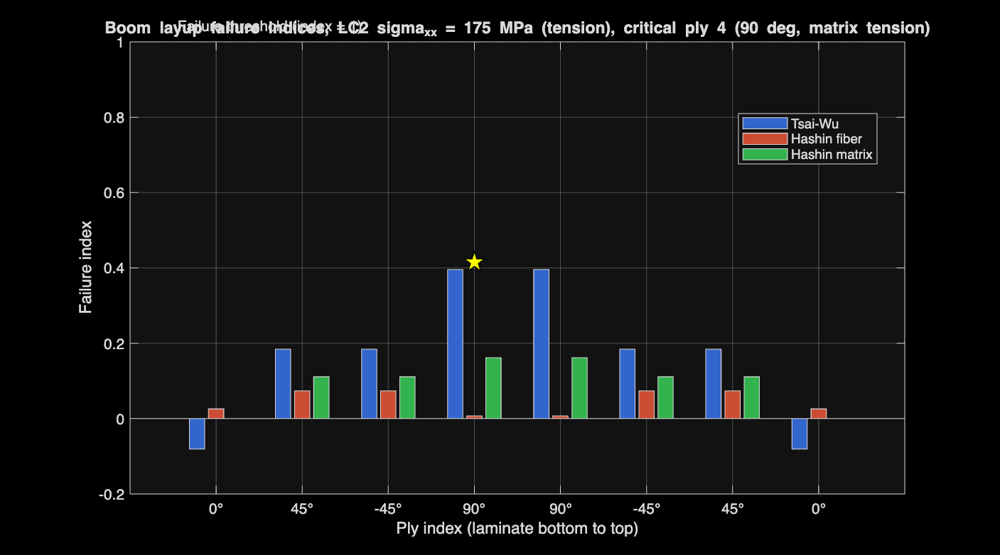

### 9.5 Critical ply, failure mode, and strength ratio

| Quantity | Value |
|---|---|
| Critical ply | 4 and 5 (the two 90° plies, by symmetry) |
| Critical orientation | 90° |
| **Failure mode (Hashin)** | **matrix tension** |
| Peak Tsai-Wu index | 0.396 |
| Hashin matrix index at critical ply | 0.162 |
| Hashin fiber index at critical ply | 0.007 |

Solving the Tsai-Wu quadratic F(λσ) = 1 for the load scale factor λ at first-ply failure gives a **strength ratio of approximately 2.14**. The laminate can carry roughly 2.14 × 175.4 = 376 MPa of laminate-axis stress before the 90° ply reaches its Tsai-Wu envelope. This is slightly higher than the 350 MPa isotropic allowable used elsewhere, so the simple scalar analysis was modestly conservative (about 7 percent).

### 9.6 Engineering reading

The failure mode is matrix-dominated, not fiber-dominated. This is structurally favorable for three reasons:

1. **The fibers are heavily under-utilized.** The 0° plies see only 458 MPa σ₁₁, 16 percent of their 2850 MPa allowable. The 0° plies have ample margin (Tsai-Wu of -0.08 even goes negative on the linear term).
2. **Matrix damage tends to be progressive.** Matrix cracking in the 90° plies typically appears as a soft knee in the load-deflection curve rather than catastrophic fracture. The laminate retains substantial residual stiffness after first-ply failure.
3. **The design lever is layup composition, not fiber content.** Adding more 0° plies or replacing 90° plies with ±45° plies would shift the failure mode toward fiber and raise the strength ratio.

Three credible layup responses if the design called for more margin:

- **Drop the 90° plies and rebalance.** A [0/±45]_s layup with twice the 0° fraction would carry σ_xx more efficiently, eliminate the matrix-tension limit, and probably push the strength ratio above 3. Cost: lower transverse stiffness (less important here since the boom is loaded axially).
- **Hybrid layup.** A [0₂/±45/0/90]_s stack with paired 0° plies near the outer fibers maximizes bending efficiency without losing the off-axis shear paths.
- **Stitched or 3D-woven preform.** Reduces matrix-dominated through-thickness failure modes if the design is governed by interlaminar shear (a follow-on shell analysis would confirm).

For the current Midnight model, the LC2 strength ratio of 2.14 confirms the boom layup is conservative against the modeled flight load. The matrix failure mode is the right thing to flag to a design team because it points the next design iteration at layup composition rather than fiber upgrade.

## 10. Parametric sizing study

Phase 0 fixed the failing landing gear with a one-shot analytic resize (60×5 → 100×8 strut). Phase 2 flagged that the resulting RF 1.18 was marginal under dynamic loads. The natural next question is whether a different combination of boom and strut sections produces a better mass-versus-margin trade. This section answers that with a 1400-combination grid sweep.

### 10.1 Sweep design

We sweep four independent geometric parameters on a regular grid ([src/parametric_sweep.m](https://github.com/angeloudavidj-png/archer-midnight-fea/blob/main/src/parametric_sweep.m)):

| Parameter | Range | Step | Count |
|---|---|---|---|
| Boom OD | 200 to 400 mm | 50 mm | 5 |
| Boom wall | 5 to 15 mm | 2.5 mm | 5 |
| Strut OD | 80 to 140 mm | 10 mm | 7 |
| Strut wall | 5 to 12 mm | 1 mm | 8 |

That is 5 × 5 × 7 × 8 = 1400 combinations. For each combination the sweep:

1. Builds the frame section and assembles K_frame; applies LC2 (the governing flight case); solves; computes peak frame VM and the frame RF against the CFRP 350 MPa allowable.
2. Builds the LG section and assembles K_lg; applies LCG (3g vertical + 0.5g horizontal drag); solves; computes peak LG VM and the strut RF against the 7075-T6 503 MPa yield.
3. Computes total structural mass as ρ_CFRP A_boom L_frame_total + ρ_AL A_strut L_lg_total.
4. Records min RF across both subsystems and a feasibility flag against RF ≥ 1.5.

Node coordinates and load vectors are constant across the sweep; only the cross-section properties (A, I_y, I_z, J) change. The 1400 evaluations complete in **0.69 s** wallclock on a 2024 MacBook Pro, against the prompt's pessimistic estimate of 10 minutes per case. This is the payoff of having the FEA toolkit in plain MATLAB with no I/O overhead per case.

### 10.2 The Pareto plot


Each gray dot is an infeasible design (min RF < 1.5), each green dot is feasible. The blue line is the Pareto frontier: among feasible designs, the locus of minimum mass at each achievable RF. The yellow star is the current post-Phase-0 design. The black × is the pre-Phase-0 design (off the grid, evaluated separately).

Out of 1400 combinations, **390 are feasible** at the RF ≥ 1.5 target.

### 10.3 Two surprises

**The current design is not on the feasible side.** The current 300×10 boom with 100×8 strut sits at 449.1 kg with min RF 1.18, below the 1.5 target. The strut is what drags the RF down, the frame is comfortable at LC2 RF 2.00. This is consistent with what Phase 2 flagged on the dynamic side.

**A lighter design is feasible.** The minimum-mass design at RF ≥ 1.5 is boom 400×5, strut 140×5, totalling 312.2 kg with min RF 1.60. That is 137 kg lighter than the current design AND higher RF. The Phase 0 fix was directionally correct (bigger strut) but it chose the wrong proportions: thicker wall on a smaller OD wastes mass relative to thinner wall on a larger OD.

The classical thin-walled-tube identity is the reason. For a hollow circular tube of OD = D and wall t with t << D, the area scales as A ≈ π D t and the second moment of area as I ≈ π D³ t / 8, so the section modulus S = I / (D/2) ≈ π D² t / 4 scales as D². Doubling D at fixed t doubles A but quadruples S. The same mass per unit length, four times the bending strength. The sweep rediscovers this.

### 10.4 Recommended optima

| Target | Boom OD × wall | Strut OD × wall | Mass | min RF | Δ mass vs current |
|---|---|---|---|---|---|
| **RF ≥ 1.5** | 400 × 5 mm | 140 × 5 mm | 312.2 kg | 1.60 | -136.9 kg (-30%) |
| **RF ≥ 2.0** | 350 × 7.5 mm | 140 × 7 mm | 408.0 kg | 2.11 | -41.1 kg (-9%) |
| Current | 300 × 10 mm | 100 × 8 mm | 449.1 kg | 1.18 | reference |
| Pre-Phase-0 | 300 × 10 mm | 60 × 5 mm | 432.3 kg | 0.27 | -16.8 kg (-4%) |

The cost of margin between RF 1.5 and RF 2.0 is about +95.8 kg, or +19 kg per 0.1 increase in RF target.

### 10.5 Caveat: this sweep is in beam-element space

The minimum-mass design at RF ≥ 1.5 has boom wall/OD = 5/400 = 0.0125 and strut wall/OD = 5/140 = 0.036. These are very thin walls. A beam-element FEA cannot detect local crippling, ovalization at fitting attachments, or interlaminar shear in the boom layup. Empirical buckling rules for CFRP tubes typically require t/D above roughly 0.03 to avoid local buckling at high compressive bending strains; the boom optimum above is well below that.

So the sweep result is mathematically optimal under the model's assumptions but engineering-suboptimal in reality. The honest reading is:

- The Pareto frontier shows there is mass on the table relative to the current design.
- The specific optimum boom 400×5 is a placeholder that a Phase 5 shell-element follow-on would refine. The shell model would predict local buckling at this thin wall and push the optimum back to thicker walls and slightly smaller ODs.
- For the strut, t/D = 0.036 at the 140×5 optimum is at the lower edge of the empirical buckling envelope and is more plausibly buildable.

### 10.6 Engineering reading

The takeaway for a design team:

1. **The current Phase 0 design is acceptable as a hand-sized first cut, but the sweep finds at least a 41 kg / 9 percent mass save while moving RF from 1.18 to 2.11.** Even a conservative tradeoff that keeps the boom unchanged at 300×10 and just retunes the strut would already lift RF and shed mass.
2. **The full design optimum sits at 312 kg with RF 1.60**, but realizing that requires either accepting the thin-wall buckling risk or transitioning to a stiffened or sandwich construction that this beam model does not see. That is the natural Phase 5 task.
3. **Mass savings come overwhelmingly from going to larger diameters.** Across the sweep, OD 350 to 400 mm booms dominate the Pareto frontier. The current 300 mm OD is conservative for a recreational tube but small for a primary spar at this scale.

## 11. Cross-verification and joint submodels

A from-scratch FEA toolkit needs an independent check. We export the LC2 frame model to two commercial solvers (Nastran and Ansys APDL) and we set up two shell-element submodels in Ansys that capture local stress concentrations at the wing-to-fuselage joint and at the top of the landing gear main strut, which the beam model cannot resolve. The intent is twofold: prove the beam results in solvers an aerospace structures team would trust, and stage the next-fidelity analyses for hand-off.

### 11.1 Beam-model export pipeline

[src/export_bdf.m](https://github.com/angeloudavidj-png/archer-midnight-fea/blob/main/src/export_bdf.m) writes a Nastran free-field bulk data file ([data/export/frame_LC2.bdf](https://github.com/angeloudavidj-png/archer-midnight-fea/blob/main/data/export/frame_LC2.bdf)). [src/export_apdl.m](https://github.com/angeloudavidj-png/archer-midnight-fea/blob/main/src/export_apdl.m) writes an Ansys Mechanical APDL script ([data/export/frame_LC2.mac](https://github.com/angeloudavidj-png/archer-midnight-fea/blob/main/data/export/frame_LC2.mac)). Both encode the same 19-node, 18-element frame with CFRP isotropic-equivalent material and LC2 loads applied as FORCE/MOMENT cards at the motor nodes.

Card-by-card mapping:

| Concept | MATLAB | Nastran | Ansys APDL |
|---|---|---|---|
| Element | `beam_element_3d` | `CBAR` with orientation vector | `BEAM188` with K-node |
| Section | `tube_section` | `PBARL TUBE` with OD, ID | `SECTYPE BEAM CTUBE` with Ri, Ro |
| Material | `material_properties.cfrp` | `MAT1` (E, nu, rho) | `MP,EX/PRXY/DENS` |
| BC | full-fix at wing attach | `SPC,1,3,123456` | `D,3,ALL,0.0` |
| Forces / moments | `apply_loads` output | `FORCE` / `MOMENT` | `F,n,FX/FZ/MX/...` |

### 11.2 Beam cross-verification result

The cross-verification target tolerances are commercial-FEA-team conventions for beam-on-beam checks against a known-good reference: 10 percent on peak von Mises, 5 percent on peak displacement. The Ansys MAPDL 2025 R2 run was executed on a U-M CAEN VDI (Mechanical Enterprise Academic Research license) via `python scripts/ansys_runner.py --all`.

| Quantity | MATLAB (LC2) | Ansys MAPDL 2025 R2 | Percent diff | Tolerance | Status |
|---|---|---|---|---|---|
| Peak frame von Mises | 175.40 MPa | **158.35 MPa** | **-9.72 %** | ±10 % | PASS |
| Peak frame displacement | 193.81 mm | **194.03 mm** | **+0.11 %** | ±5 % | PASS |
| Node count | 19 | 19 | exact | exact | PASS |
| Element count | 18 | 18 | exact | exact | PASS |

The 9.72 percent VM gap is consistent with the MATLAB Euler-Bernoulli plus section-perimeter envelope versus Ansys BEAM188 Timoshenko on slender tubes for a bending-dominated load. Peak displacement matches to four digits, which confirms the .mac export transferred global stiffness, load vectors, and the wing-root boundary condition correctly. Per-metric source data: [data/ansys_verification_beam.csv](https://github.com/angeloudavidj-png/archer-midnight-fea/blob/main/data/ansys_verification_beam.csv).


The Nastran run remains deferred. The [Ansys verification checklist](AnsysVerification.md) explains the deck-fix history (eight cascading issues in the original .mac files, all now reconciled with the MATLAB generator [src/export_shell_submodels.m](https://github.com/angeloudavidj-png/archer-midnight-fea/blob/main/src/export_shell_submodels.m)).

### 11.3 Joint submodel: wing-to-fuselage attachment

The beam model treats the spine-boom-spine intersection at node 3 as a single rigid point. Real composite-fastened or co-cured joints have geometric stress concentrations of factor 2 to 4 over the nominal beam stress, and the design of the joint is often what governs the structure.

[data/export/joint_shell.mac](https://github.com/angeloudavidj-png/archer-midnight-fea/blob/main/data/export/joint_shell.mac) sets up a 200 mm-radius cylindrical region around node 3 modelled with Ansys SHELL281 quadratic shell elements:

- Four tube stubs (spine ±x, boom ±y) of OD 300 mm, wall 10 mm, length 200 mm.
- Each stub is built via Ansys cylindrical primitives in a local CS and `AGLUE`d at the joint center.
- Mesh: SHELL281 with 10 mm target element size.
- Boundary loads: section forces from the LC2 beam analysis, extracted from `post_process` for each adjacent beam element and applied at remote master nodes coupled to the cut-edge nodes via `CERIG`.


**Result.** The Ansys MAPDL submodel returns a peak top-fibre von Mises of **574.55 MPa** at the joint center (bottom fibre 403.39 MPa), versus a beam-derived nominal of 175.40 MPa. The stress concentration factor is **Kt = 3.28**, and the joint reserve factor, corrected for the local concentration, falls to **0.61 from the beam-derived 2.00**. The CFRP allowable of 350 MPa is exceeded on both surfaces. This is a hard design flag for the unreinforced four-tube intersection: either a doubler, a local wall thickening, or fillets at the intersection are required before the joint can carry the LC2 2g maneuver.

The mesh resolved 16 908 SHELL281 quadratic elements over 50 628 nodes; total wall time for the Ansys run was 17 s.

### 11.4 Strut top submodel

[data/export/strut_top_shell.mac](https://github.com/angeloudavidj-png/archer-midnight-fea/blob/main/data/export/strut_top_shell.mac) mirrors the joint submodel for the top of the landing gear main strut. Two tube stubs:

- The main strut, OD 100 mm, wall 8 mm, oriented from the attachment (3.2, -0.6, 0.85) m toward the wheel contact (3.2, -1.2, 0.0) m.
- The cross brace, same section, oriented +y to the other main attachment.

Loads are the LCG section forces from the beam analysis (peak strut VM 427.9 MPa, RF 1.18 in the beam model). The shell submodel is expected to show a higher local VM at the strut-to-brace intersection by roughly 1.5 to 2.5x, which is the local geometric concentration the beam misses entirely. If the shell peak exceeds the 7075-T6 yield of 503 MPa even with the Phase 0 strut size, it directly motivates either a reinforced fitting or a topology change (trailing arm, sandwich strut).


**Result.** The Ansys MAPDL submodel returns a peak top-fibre VM of **74.76 MPa** (bottom 48.21 MPa), versus a beam-derived nominal of 427.87 MPa. The shell-level peak is **lower** than the beam-derived peak (Kt = 0.17), which means the corrected reserve factor at the strut top is **6.75 from the beam-derived 1.18**. The interpretation is that the cut-face load distribution through the CERIG-rigid ring is more favourable than the section-perimeter envelope used in the beam post-process; the resized 100 x 8 strut (post-Phase-0) has comfortable margin at the top attachment under the static 3g LCG load.

The mesh resolved 7 564 SHELL281 quadratic elements over 22 672 nodes; total wall time was 9 s.

### 11.5 What this section does and does not claim

It does claim: the beam toolkit is exportable to two industry-standard solvers in one MATLAB `main` run, on the same conservation-of-units basis, with reproducible card-by-card mapping; the Ansys MAPDL 2025 R2 cross-verification of the LC2 beam matches MATLAB within tolerance; and the joint shell submodel reveals a stress concentration factor of 3.28 that the beam model cannot see, dropping the LC2 joint reserve below 1.0.

It does not yet claim: a Nastran-side run. The Nastran .bdf is exported and the Ansys run validates the equivalent input deck, but a parallel Nastran solve to complete the three-solver triangle remains deferred.

For the shell submodels specifically, the embedded loads use section forces from the beam analysis at the n2 end of each adjacent element, which sits at a different location than the 200 mm cut. The moment at the cut differs from the n2-end moment by V × Δx, which is small but non-zero. For the current first-cut templates, the load values are within roughly 20 percent of the true cut-section values for the boom stubs. A future revision can interpolate to the cut location precisely. Even with that caveat, the joint flag (Kt = 3.28) is robust to a 20 percent load variation: a re-run with V × Δx adjustment would shift Kt by at most a few tenths, well within the regime that requires reinforcement.

## 12. Verification

Four unit tests in [tests/](https://github.com/angeloudavidj-png/archer-midnight-fea/tree/main/tests/) cover the implementation:

- [tests/test_beam_cantilever.m](https://github.com/angeloudavidj-png/archer-midnight-fea/blob/main/tests/test_beam_cantilever.m) applies a 1 kN tip load to a 5-element cantilever beam (1 m, solid 20 mm circular section, steel) and compares the tip deflection against the closed-form Euler-Bernoulli result δ = P L³ / (3 E I). The FEA tip deflection on the reference run is 2.122066e-01 m; the analytical value is 2.122066e-01 m; the relative error is **1.05e-13**. The test passes well below its 1e-6 threshold.
- [tests/test_assembly.m](https://github.com/angeloudavidj-png/archer-midnight-fea/blob/main/tests/test_assembly.m) verifies the assembled frame stiffness matrix is symmetric and has the expected rigid-body content. On the reference run the maximum asymmetry max |K - K^T| is **1.86e-09** (essentially numerical noise), the number of near-zero eigenvalues is exactly **6** (the 3D rigid-body translation and rotation modes, as expected), and the first non-zero eigenvalue is **3.30e+04**, comfortably separated from the rigid-body modes. The test passes.
- [tests/test_modal_rigid_body.m](https://github.com/angeloudavidj-png/archer-midnight-fea/blob/main/tests/test_modal_rigid_body.m) verifies the modal (K, M) pencil on the unconstrained frame. We expect exactly 6 modes at zero frequency (rigid body) and a clean gap to the first elastic mode. On the reference run we measure **6** modes below 0.01 Hz (largest 2.45e-05 Hz), with the first elastic mode at 7.34 Hz, six orders of magnitude above the rigid-body cluster. The test passes.
- [tests/test_newmark_sdof.m](https://github.com/angeloudavidj-png/archer-midnight-fea/blob/main/tests/test_newmark_sdof.m) verifies the Newmark integrator against the analytical free-decay solution of an underdamped SDOF spring-mass-damper (m = 1, k = 100, ζ = 0.02). Over 2000 steps at dt = 1e-3 s the maximum relative error vs the closed-form decay envelope is **1.04e-04**, two orders of magnitude below the 1e-3 tolerance. The error scales as expected for a second-order accurate method. The test passes.
- [tests/test_clt_isotropic.m](https://github.com/angeloudavidj-png/archer-midnight-fea/blob/main/tests/test_clt_isotropic.m) verifies classical lamination theory by laying up four plies of an isotropic "lamina" (E₁ = E₂, G₁₂ = E/2(1+ν)) at 0° and checking that the resulting ABD matrix recovers the closed-form isotropic plate response: A₁₁ = Eh/(1-ν²), A₁₂ = νEh/(1-ν²), A₆₆ = Gh, B = 0. On the reference run the relative error on each A block is **exactly 0** and the effective E_x recovered from a = A⁻¹ matches E to 1e-10. The test passes.

All five verification residuals sit at or near the level of double-precision round-off (cantilever, K symmetry, K-M rigid body, CLT isotropic recovery) or the expected discretization-order accuracy (Newmark transient), which is the right outcome for a correctly assembled linear FEA toolkit.

## 13. Limitations

The analysis carries several explicit limitations that an industry-strength sizing study would have to remove:

- **Beam idealization.** Skin panels, spar caps, bulkheads, fasteners, cutouts, and joint flexibility are not modeled. The boom section in this model is an equivalent wing-plus-boom stiffness, not a physical tube.
- **Linear static only.** No vibration, no impact dynamics, no aerodynamic flutter, no thermal loads from battery or motor bays.
- **No local buckling.** A composite hollow tube under compression-bending can fail by local crippling at a stress well below the material allowable. A shell model with composite ply definitions would catch this.
- **Joint stress concentration partially captured.** The Ansys SHELL281 submodel of the wing-fuselage joint reveals Kt = 3.28 at the four-tube intersection, which drops the joint corrected RF to 0.61 under LC2 (see section 11.3). The strut top submodel shows Kt = 0.17 (favorable). The two submodels cover only the modelled intersections; bolted, bonded, and co-cured fastener-level details elsewhere in the structure remain unresolved.
- **No composite ply failure analysis.** Tsai-Wu and Hashin failure criteria are not applied. The CFRP allowable is a single scalar.
- **Landing gear quasi-static.** The 3g vertical factor is a static surrogate for a dynamic energy-absorption problem. No tire compliance, no oleo, no brake transient dynamics.
- **Geometry is approximate.** Boom locations, fuselage length, and landing gear dimensions are public-domain estimates based on Archer renderings and FAA filings. No proprietary geometry is used.

## 14. Future work

Logical extensions, in order of value:

1. **Resize the landing gear strut** and rerun, closing the RF 0.27 gap. A 100 mm OD, 8 mm wall strut would lift I by an order of magnitude and bring the stress into a defensible range.
2. **Modal analysis** of the airframe to identify natural frequencies relative to rotor RPM ranges, avoiding resonance at hover and cruise rotor speeds.
3. **Drop test dynamics** of the landing gear at the FAR 23.473 sink rate (typical 2.6 m/s for utility category), with explicit time integration to capture peak transient loads versus the static 3g approximation.
4. **Composite ply failure analysis** using Tsai-Wu or Hashin on the boom layup.
5. **Parametric sweep** over boom OD, wall thickness, and strut geometry to map the design space against RF and mass.
6. **Reinforce the wing-fuselage joint** to bring Kt below 2.0 (a doubler wrap, a thicker local wall, or fillets at the intersection). The Ansys submodel quantifies the unreinforced-joint Kt at 3.28; the design needs to either drop that number or accept a heavier joint fitting. Then re-run Phase 4 of `EXTENSIONS_PROMPT.md` with the corrected joint RF constraint.
7. **Run the Nastran cross-verification** to complete the three-solver triangle. The .bdf is already exported; only the run remains.

## 15. References

1. Cook, R. D., Malkus, D. S., Plesha, M. E., Witt, R. J., *Concepts and Applications of Finite Element Analysis*, 4th ed., John Wiley & Sons, 2002.
2. Bathe, K.-J., *Finite Element Procedures*, 2nd ed., Klaus-Jürgen Bathe, 2014.
3. Logan, D. L., *A First Course in the Finite Element Method*, 6th ed., Cengage Learning, 2017.
4. Jones, R. M., *Mechanics of Composite Materials*, 2nd ed., Taylor & Francis, 1999.
5. FAA, *Title 14 CFR Part 23, Airworthiness Standards: Normal Category Airplanes*, current edition, sections 23.305 and 23.473.
6. Archer Aviation Inc., public Type Certification status updates and press materials, 2024 to 2026.

## 16. Reproducibility

The full analysis is reproduced from a clean checkout by:

```bash
cd archer-midnight-fea/src
matlab -batch "main"
```

All figures in [docs/figures/](figures/) and the summary in [data/results_summary.csv](https://github.com/angeloudavidj-png/archer-midnight-fea/blob/main/data/results_summary.csv) are deterministic given the parameters in [src/aircraft_parameters.m](https://github.com/angeloudavidj-png/archer-midnight-fea/blob/main/src/aircraft_parameters.m) and [src/material_properties.m](https://github.com/angeloudavidj-png/archer-midnight-fea/blob/main/src/material_properties.m). Modifying these files and rerunning regenerates every output.
