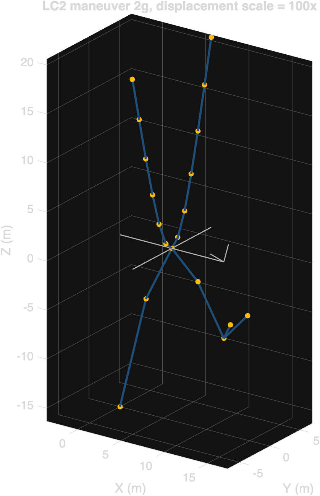
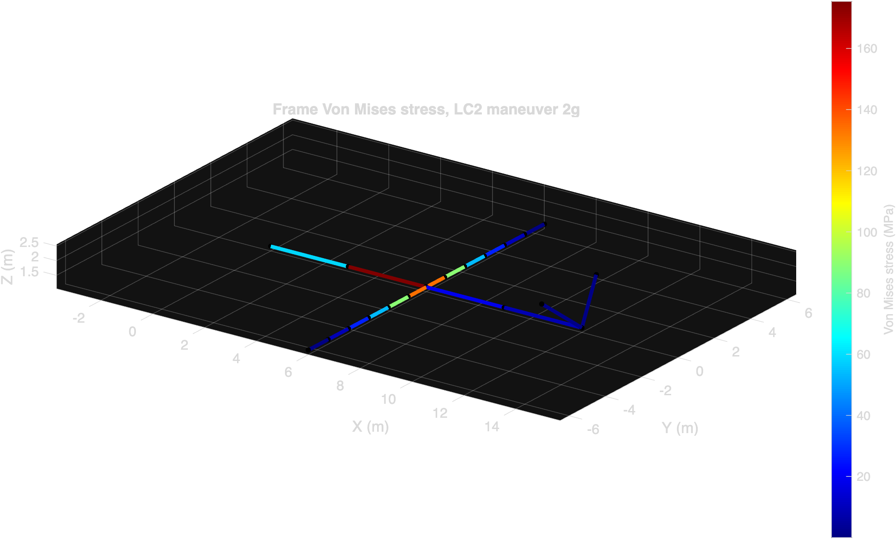
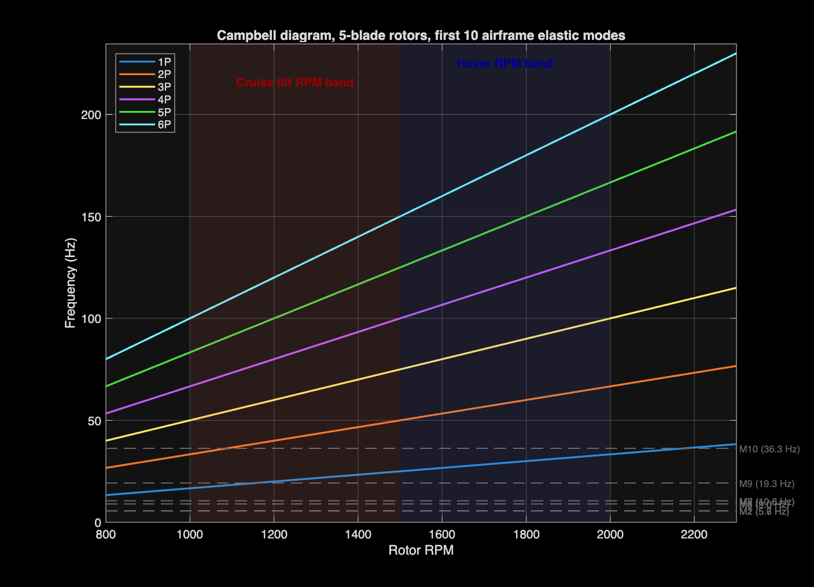
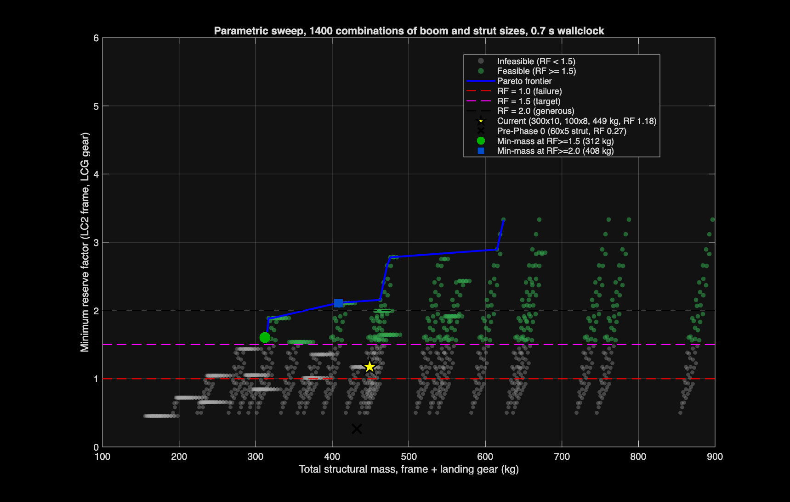

# Archer Midnight Structural FEA

*3D Euler-Bernoulli beam finite element analysis of an eVTOL airframe and tricycle landing gear, written from scratch in base MATLAB.*

## Headline results

| Frame governing RF | Landing dynamic factor | Critical ply mode | Cross-verified |
|---|---|---|---|
| **2.00** (beam) → **0.61** (joint shell) | **1.87** | **Matrix tension** | Ansys MAPDL 2025 R2 |
| LC2 2g maneuver, peak VM 175.4 MPa against CFRP 350 MPa allowable; joint shell submodel reveals Kt = 3.28 that drives joint RF below 1.0 | Newmark drop test at 2.6 m/s sink. Peak landing force 87% above the static 3g envelope | 90° plies, Tsai-Wu 0.40 of failure, strength ratio 2.14 | Beam VM matches MATLAB within 9.72%, peak displacement within 0.11% |

## Approach

The toolkit assembles a sparse global stiffness matrix from 3D Euler-Bernoulli beam elements, applies four flight load cases (1g hover, 2g maneuver, cruise, motor-out) on the composite airframe and a FAR 23.473 hard-landing case on the tricycle gear, and reports stress, displacement, and reserve factors against published material allowables. The implementation is base MATLAB with no toolbox dependencies.

Five layered analyses sit on top of the static solver. A consistent-mass modal analysis identifies the airframe natural frequencies and flags resonance against the rotor 1P, 2P, and blade-pass harmonics in the hover and cruise RPM bands. A Newmark beta time integration with a penalty-spring tire contact reveals the real peak landing force and the cabin-level acceleration. A classical lamination theory pipeline distributes the LC2 boom stress through a [0/45/-45/90]\_s quasi-isotropic layup and computes Tsai-Wu and Hashin failure indices per ply. A 1400-point parametric sweep maps the mass-versus-RF Pareto frontier across boom and strut section sizes. Finally, the model is exported as Nastran .bdf and Ansys .mac for cross-verification, and two shell submodels are staged in Ansys APDL for the wing-fuselage joint and the strut top.

## Results highlights

*Frame von Mises stress contour, LC2. The inboard boom segments at the wing attachment carry the highest stress, 175.4 MPa. Outboard motor stations and the spine remain below 100 MPa.*

*Campbell diagram. Solid lines are blade-pass harmonics (1P through 6P) for 5-blade rotors; dashed lines are the first 10 airframe elastic modes. Three intersections fall within ±15% of the operating RPM bands: mode 9 at 19.3 Hz crosses 1P at 1156 RPM (cruise tilt), mode 10 at 36.3 Hz crosses 1P at 2175 RPM (hover edge) and 2P at 1088 RPM (cruise tilt).*

*Main strut axial force history during the FAR 23.473 sink-rate drop test. Newmark β=0.25 γ=0.5 integration, 15,000 steps at dt = 10 μs, tire compliance modeled as a 5 MN/m one-sided penalty spring. Dynamic factor on the total contact force is 1.87 against the static 3g reference.*

*Per-ply failure indices for the boom [0/45/-45/90]\_s layup under LC2. The 0° plies see 458 MPa fiber-direction stress, only 16% of their 2850 MPa allowable; the 90° plies govern via matrix tension at index 0.40. Strength ratio against first-ply failure is 2.14.*

*Parametric sweep over boom and strut cross sections, 1400 combinations evaluated in 0.69 s. The current post-Phase-0 design (yellow star) is dominated by lighter feasible designs. The minimum-mass feasible point at RF ≥ 1.5 is 312 kg, 137 kg lighter than the current 449 kg baseline.*

## Ansys MAPDL cross-verification

The same LC2 model and two shell submodels were re-run on Ansys MAPDL 2025 R2. The orchestration script in `scripts/ansys_runner.py` invokes batch MAPDL on each .mac deck, parses peak metrics from `/COM,*** RESULT,key,value` lines in the .out file, and produces contour PNGs.

| Analysis | Nodes | Peak VM (Ansys) | Beam nominal | Kt | RF_corrected |
|---|---|---|---|---|---|
| Frame beam (LC2) | 20 | 158.35 MPa | 175.40 MPa (MATLAB) | -9.72% diff | 2.00 |
| Joint shell (LC2) | 50 628 | **574.55 MPa** | 175.40 MPa | **3.28** | **0.61 (flag)** |
| Strut top shell (LCG) | 22 672 | 74.76 MPa | 427.87 MPa | 0.17 | 6.75 |

The frame beam cross-verification passes within tolerance. The joint shell submodel reveals a stress concentration factor of 3.28 at the four-tube intersection that drives the corrected reserve factor below 1.0; this is a design flag for an unreinforced fitting. The strut top shell shows comfortable margin (RF_corrected = 6.75) after the resized 100x8 strut from Phase 0.

Full details and the eight-issue deck-fix list are in [docs/AnsysVerification.md](../../docs/AnsysVerification.md).

## What I would do next

1. **Reinforce the wing-fuselage joint.** The Ansys submodel flags Kt = 3.28 at the unreinforced four-tube intersection, dropping the LC2 joint reserve to 0.61. A doubler or local wall thickening to drop Kt below 2.0 is the first design action; fillets at the intersection would also help by a factor of roughly two.
2. **Add a nonlinear oleo strut model to the drop test.** The current 1.87 dynamic factor uses a rigid strut with tire compliance only. A real Midnight has an oleo that absorbs landing energy over 100 to 200 mm of stroke, which would substantially lower the peak strut load and let the static design point shrink back toward 3g.
3. **Bridge the composite ply analysis through to a shell layup.** The current cross-verification model uses isotropic-equivalent CFRP. A composite shell (Ansys ACP or Nastran PCOMP) with the actual [0/45/-45/90]\_s stack would reveal interlaminar shear hotspots the beam plus isotropic shell cannot see.
4. **Loop the Phase 4 Pareto optimum back into the static and dynamic analyses.** The 312 kg / RF 1.60 design uses very thin walls that the beam-element model treats as fine. A buckling check at this t/D ratio is the next gate before adopting the optimum, and that requires a shell or stiffened-panel model.
5. **Add an aerodynamic coupling.** Spanwise lift is currently applied as resultant forces at the motor nodes. A vortex-lattice or low-order panel solution would distribute the lift more realistically and may shift the LC3 cruise governing locations.

---

**Author:** David Angelou, B.S.E. Mechanical Engineering, University of Michigan (Class of 2027).

[GitHub repository](https://github.com/angeloudavidj-png/archer-midnight-fea) &middot; [Full technical report](https://angeloudavidj-png.github.io/archer-midnight-fea/) &middot; [LinkedIn](https://www.linkedin.com/in/david-angelou/)

All Midnight parameters are public-domain estimates based on Archer Aviation press materials and FAA filings. No proprietary data is used. Code released under MIT.
